* Table of Contents
{:toc}

--------------------------------------------------------------------------------------------------------------------
## **Introduction**

CAP5Buddy helps NUS SoC students to keep track of their module details efficiently. It helps them centralize key
module details and follows their study progress through a Command Line Interface (CLI) that allows efficient management
of module details. CAP5Buddy also functions as a scheduling system, todo list and contact list.

## **1. Setting up**

Refer to the guide [_Setting up and getting started_](SettingUp.md).

--------------------------------------------------------------------------------------------------------------------

## **2. Design**

### Architecture

**How the architecture components interact with each other**

This is the overall design of our product. As we are using **GUI to help to display the information** and mainly focuses on
using **CLI to take in the required commands**, thus the product consists of **6 main major components**. The product starts
from the Launcher classes, that initiates based on our pre-set settings and then activates the MainApp class
the will run the GUI with these settings. MainApp will also start the _brain_ and _muscles_ of the program, which are the Logic, Storage,
Model and Ui components.

### Overall components

**`Main`** has two classes called [`Main`](https://github.com/nus-cs2103-AY2021S1/tp/blob/master/src/main/java/seedu/address/Main.java) and [`MainApp`](https://github.com/nus-cs2103-AY2021S1/tp/blob/master/src/main/java/seedu/address/MainApp.java). It is responsible for,
* At app launch: Initializes the components in the correct sequence, and connects them up with each other.
* At shut down: Shuts down the components and invokes cleanup methods where necessary.

[**`Commons`**](#common-classes) represents a collection of classes used by multiple other components.

The rest of the App consists of four components.

* [**`UI`**](#ui-component): The role of the **Ui** component is to handle all the User interface related instructions, which includes the loading of GUI components, the updating
of these components and displaying the changes.
* [**`Logic`**](#logic-component): The role of the **Logic** component is to act as the _brain_ of the program, where all the parsing of information will be done, and the
execution of the commands will be carried out.
* [**`Model`**](#model-component): The role of the **Model** component is to represent all the items and their behaviours. Contains all the item classes and their support classes.
* [**`Storage`**](#storage-component): The role of the **Storage** component is to represent the _memory_ of the program, where the storing and tracking of the different items happens.
These items are saving locally in a json file, which can be imported and exported easily.

Each of the four components,

* defines its *API* in an `interface` with the same name as the Component.
* exposes its functionality using a concrete `{Component Name}Manager` class (which implements the corresponding API `interface` mentioned in the previous point.

For example, the `Logic` component defines its API in the `Logic.java` interface and exposes its functionality using the `LogicManager.java` class which implements the `Logic` interface.

**How the architecture components interact with each other**

The *Sequence Diagram* below shows how the components interact with each other for the scenario where the user issues the command `delete 1`.

The sections below give more details of each component.

### UI component
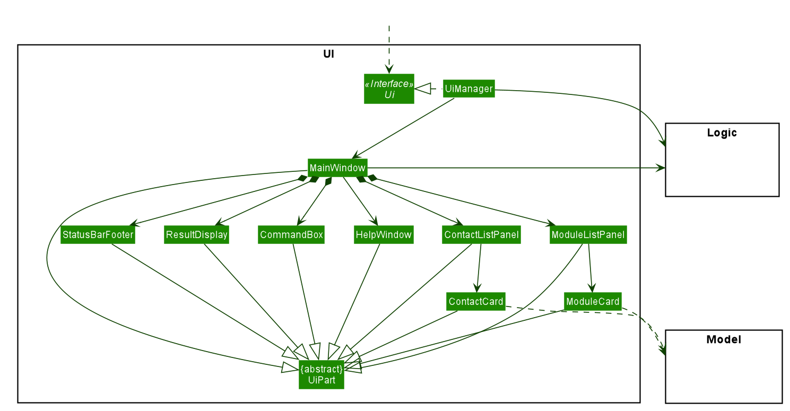

The job of the UI component is to be the _face_ of the product, which the user directly interacts with.
It is in charge of containing the logic that **breaks down and executes the user input**, and displaying the **GUI** of the
product.

It composes of a few main classes, that serves as the focal point of this component. Such classes are **UiPart**,
**MainWindow**, **UiManager** and the respective panel displays, **(XYZListPanel)**. The rest of the classes are supporting
classes to help make the GUI.

The MainWindow is what the user actually sees, which has a **CommandBox**, **XYZListPanel**, **ResultDisplay** and **StatusBar**. These
components are stacking on top of one another using **stackPane** to ensure a smooth looking GUI. The order of the components
are as follows, **CommandBox**, **ResultDisplay**, **XYZListPanel** and **StatusBar**.

The **CommandBox** is just a textField component where the user can enter the commands. Upon pressing *Enter*, extracting of the
text occurs and is sent to the logic to be parsed and executed.

Next, after the executing is completed, a **CommandResult** object returns and is then passed to the **ResultDisplay** for the
relevant information to be shown in this component. This is being displayed in a TextArea component.

Lastly, the **XYZListPanel** is in charge of displaying all the modules, contacts, etc that is the product is tracking.
Each of these items are being displayed in a *cell* under their respective **XYZCard**, which will be displayed in the *ListCell*
of the **XYZListPanel**.

**API** :

### Logic component

**API** : `Logic.java`

1. `Logic` uses the `ParserManager` class to create the respective classes: `ModuleListParser`, `ContactListParser`, `TodoListParser`,
   `GradeTrackerParser` and `SchedulerParser` which will parse the user command.
2. This results in a `Command` object which is executed by `LogicManager`.
3. The command execution can affect the Model (e.g. adding a module).
4. The result of the command execution is encapsulated as a `CommandResult` object which is passed back to the `Ui`.
5. In addition, the `CommandResult` object can also instruct the `Ui` to perform certain actions, such as displaying
help to the user.

### Model component

**API** : [`Model.java`](https://github.com/AY2021S1-CS2103T-F12-3/tp/blob/master/src/main/java/seedu/address/model/Model.java)

The `Model`,

* stores a `UserPref` object that represents the user’s preferences.
* stores the data for these 3 types of list:
  * module tracker
  * contact list
  * todo list
* exposes an unmodifiable `ObservableList<T>` for all types of list as mentioned above which can be 'observed' e.g. the UI can be bound to this list so that the UI automatically updates when the data in the list change.
* does not depend on any of the other three components

#### Module Tracker

#### Contact List

#### Todo List

#### Scheduler

p>

##### EventList class
**EventList class** : [`EventList.java`](https://github.com/AY2021S1-CS2103T-F12-3/tp/blob/master/src/main/java/seedu/address/model/EventList.java)

* Holds and stores all the events.
* Saves to `Storage` after each execution of a command.
* Stores a `UniqueEventList` that ensures no duplicates of events.
* Duplicate events are not allowed.
##### Event class
**Event class** : [`Event.java`](https://github.com/AY2021S1-CS2103T-F12-3/tp/blob/master/src/main/java/seedu/address/model/event/Event.java)

* Holds the `EventName` and `EventTime` of the created Event.
* EventName and EventTime cannot be null.
* Events are considered to be the same if the EventName is equal.
* `Tags` are optional for each event.

##### EventName class
**EventName class** : [`EventName.java`](https://github.com/AY2021S1-CS2103T-F12-3/tp/blob/master/src/main/java/seedu/address/model/event/EventName.java)

* Holds the date for the name of the String.
* Acts like a logic container for the name of the event.

##### EventTime class
**EventTime class** : [`EventTime.java`](https://github.com/AY2021S1-CS2103T-F12-3/tp/blob/master/src/main/java/seedu/address/model/event/EventTime.java)

* Holds the date and time of the event.
* Stores the date and time as a LocalDateTime object.
* Follows a strict input format of : day-month-year 24h time, e.g. `5-12-2020 1200`
* Throws an error if the wrong format or invalid date is enterred.

### Storage component

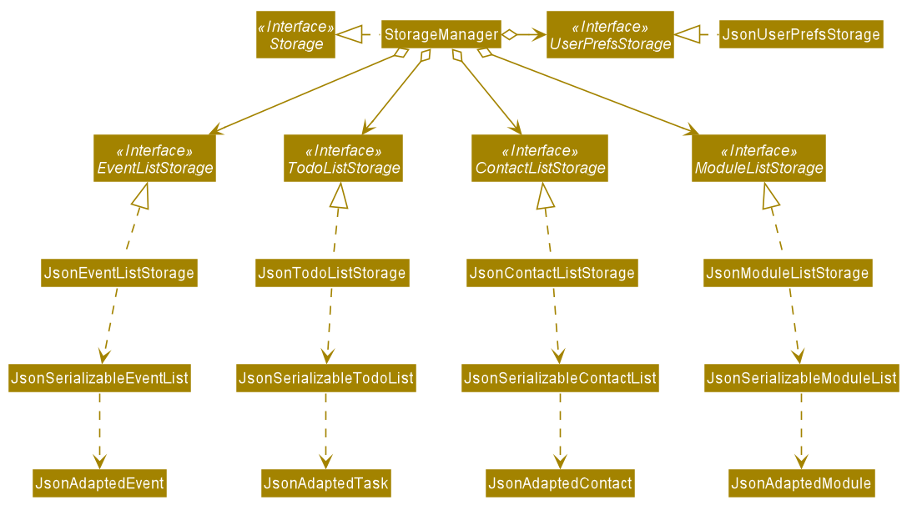

**API** : [`Storage.java`](https://github.com/se-edu/addressbook-level3/tree/master/src/main/java/seedu/address/storage/Storage.java)

The `Storage` component facilitates the storage of CAP5BUDDY data in the hard drive. When the program attempts to save
data, the `Storage` component converts java data objects such as `ModuleList` and `ContactList` into a json format to store
at a specified file location. When the program is started, it will attempt to read existing user data and the `Storage`
component will be converting data in json format into java objects.

* can save `UserPref` objects in json format and read it back.
* can save the `ModuleList` data in json format and read it back.
* can save the `ContactList` data in json format and read it back.
* can save the `TodoList` data in json format and read it back.
* can save the `EventList` data in json format and read it back.

#### Json Adapted Objects
Each of the higher level Json Adapted objects shown in the storage diagram above is dependent on other lower level Json
Adapted objects related to their feature type.

* `JsonAdaptedModule` is dependent on `JsonAdaptedTag`, `JsonAdaptedGradeTracker` and `JsonAdaptedZoomLink`.
* `JsonAdaptedGradeTracker` is dependent on `JsonAdaptedAssignment`
* `JsonAdaptedContact` is dependent on `JsonAdaptedTag`, `JsonAdaptedGradeTracker` and `JsonAdaptedZoomLink`.
* `JsonAdaptedTask` is dependent on `JsonAdaptedTag`.
* `JsonAdaptedEvent` is dependent on `JsonAdaptedTag`.
### Common classes

Classes used by multiple components are in the `seedu.addressbook.commons` package.
### Common classes

**API** :

## Module List
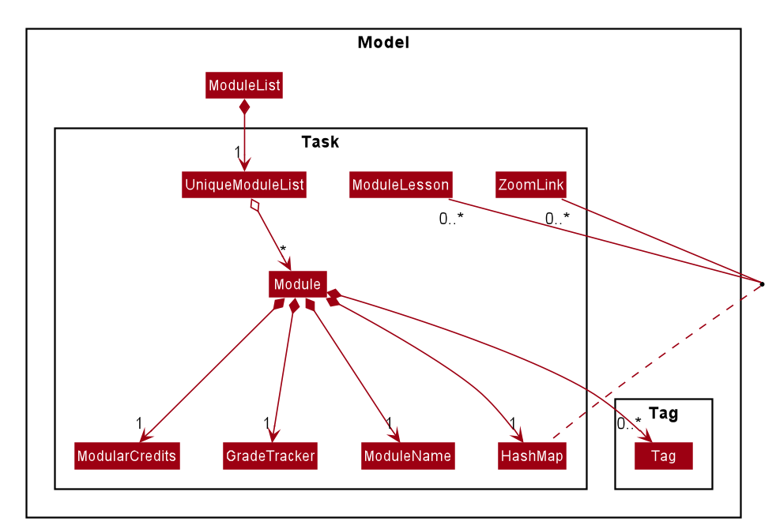

**Module package** : [`seedu.address.model.module`](https://github.com/AY2021S1-CS2103T-F12-3/tp/tree/master/src/main/java/seedu/address/model/module)

* Module is a container class that stores :
  * Name of a module
  * HashMap of ModuleLesson and ZoomLink key value pairs
  * GradeTracker of a module
  * ModularCredits of a module
  * Tag(s) of a module
* GradeTracker is a container class that stores:
  * Grade for a module
  * Assignments for a module

#### ModuleList class
**ModuleList class** : [`ModuleList.java`](https://github.com/AY2021S1-CS2103T-F12-3/tp/blob/master/src/main/java/seedu/address/model/ModuleList.java)

* Wraps all data i.e. Modules at the module list level
* Stores Modules in memory
* Stores a UniqueModuleList
* Duplicate Modules are not allowed

## Contact List

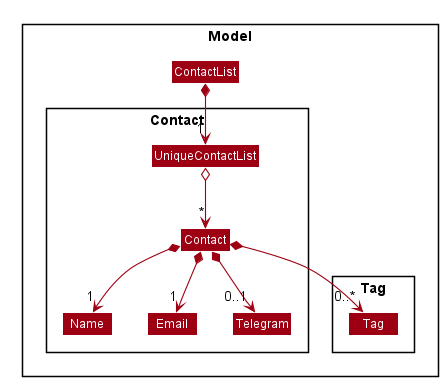

#### Contact class

**Contact package** : [`seedu.address.model.contact`](https://github.com/AY2021S1-CS2103T-F12-3/tp/tree/master/src/main/java/seedu/address/model/contact)

* Contact is a container class that stores :
  * Name of a contact
  * Email of a contact
  * Telegram of a contact
#### ContactList class
**ContactList class** : [`ContactList.java`](https://github.com/AY2021S1-CS2103T-F12-3/tp/blob/master/src/main/java/seedu/address/model/ContactList.java)

* Wraps all data i.e. Contacts at the contact list level
* Stores Contacts in memory
* Stores a UniqueContactList
* Duplicate Contacts are not allowed

## Todo List

#### Task class

**Task package** : [`seedu.address.model.task`](https://github.com/AY2021S1-CS2103T-F12-3/tp/tree/master/src/main/java/seedu/address/model/task)

* Task is a container class that stores :
  * Name of a task
  * Tags of a task
  * Priority of a task
  * Date or deadline of a task
  * Status of a task 
  Only name is compulsory when creating a new Task.

#### TodoList class

**TodoList class** : [`TodoList.java`](https://github.com/AY2021S1-CS2103T-F12-3/tp/blob/master/src/main/java/seedu/address/model/TodoList.java)

* Wraps all data i.e. Tasks at the Todo List level
* Stores Tasks in memory
* Stores a UniqueTodoList
* Duplicate Task objects are now allowed

TodoList will be explained more comprehensively in the [TodoList feature](#33-todolist-feature) Section

--------------------------------------------------------------------------------------------------------------------

## **3. Implementation**

This section describes some noteworthy details on how certain features are implemented.

### 3.1 Logic
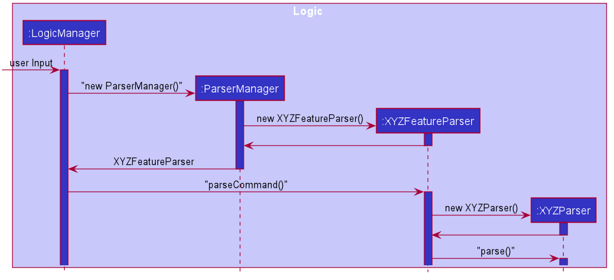
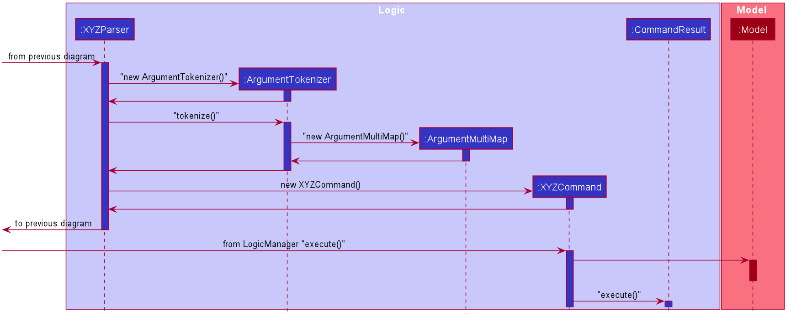

#### Implementation
The idea of this implementation is to abstract the overall process into a more OOP focused design, where each class only handles the functions
that is relevant to its responsibility. As we have many features that each have their own commands, we decided to
create a new Facade class `ParserManager` to handle which Feature parser to call. Feature parser are those in charge of
handling all commands related to that feature. For instance, `ModuleListParser` will be selected by the ParserManager when
a module related command is called.

After the appropriate feature parser is selected, the user input is passed into it to be broken down. It splits the user input into
command word and arguments, where the command word is checked and the respective sub-parser is called. For instance, if the
command word is `addmodule`, then the sub-parser that will be called is `AddModuleParser`. The argument is then passed into the
sub-parser and tokenized by `ArgumentTokenizer` and a `ArgumentMultiMap` is returned, which is a HashMap of the strings for each
prefix enterred. The relevant supporting classes are then created based on the strings under each prefix, and the appropriate
command is created.

The returned command is then executed by the `LogicManager`, which will execute the function of the command. The respecitve changes are
changed in the model provided in the command. At the end, a `CommandResult` is returned where the results are stored in.

#### Design consideration:

##### Aspect: Whether to create a Facade class `ParserManager` to handle all the individual parsers.

##### Aspect: Whether to create a custom parser for each of the feature to handle their respective commands.
Option 1 **(Current implementation)**: A custom Parser in charge of all **Scheduler** related commands **only**.
Pros: 
- More OOP orientated.
- More defensive programming.
Cons:
- More Parsers to handle by the ParserManager

Option 2: Place the Scheduler related parser together with the rest of the other parsers for other features, like module list, etc.
Pros:
- Faster to implement.
- Less effort needed, simply add on to the existing Parser.
Cons:
- Mess and less readable, hard to distinguish between different commands.
- Higher chance of errors, as we are mixing all the different parsers for every feature into a single Parser.
- LONG methods.

## 3.1 Module list management features

### Basic Module Tracker features

#### Add Module feature

This feature creates and adds a new `Module` into the `ModuleList` if the `Module` does not already exist. 

This feature is facilitated by the following classes:

 * `AddModuleParser`:
   * It implements `AddModuleParser#parse()` to parse and validate the user arguments to create a new `Module`.

 * `AddModuleCommand`:
   * It implements `AddModuleCommand#execute()` which executes the addition of the new `Module` into `Model`.

Given below is an example usage scenario and how the mechanism for adding module behaves at each step:
Step 1. `LogicManager` receives the user input `addmodule n/CS2100 mc/4.0 t/Coremodule ` from `Ui`

Step 2. `LogicManager` calls `ModuleListParser#parseCommand()` to create an `AddModuleParser`

Step 3. Additionally, `ModuleListParser` will call the `AddModuleParser#parse()` method to parse the command arguments

Step 4. This creates an `AddModuleCommand` and `AddModuleCommand#execute()` will be invoked by `LogicManager` to execute the command to add the `Module`

Step 5. The `Model#addModule()` operation exposed in the `Model` interface is invoked to add the new `Module`

Step 6. A `CommandResult` from the command execution is returned to `LogicManager`

Given below is the sequence diagram of how the operation to add a `Module` works:
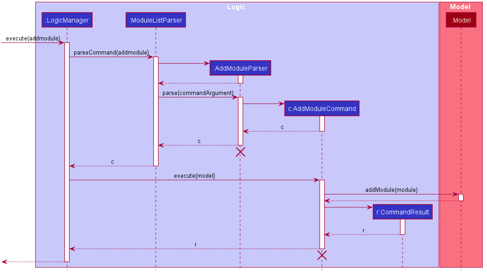
Figure 3.1.1.1 Sequence diagram for the execution of `AddModuleCommand`

:information_source: **Note:** The lifeline for `AddModuleCommand` and `AddModuleParser` should end 
at the destroy marker (X) but due to a limitation of PlantUML, the lifeline reaches the end of diagram.

The add completed module feature serves a very similar function — it calls `Model#addModule()` also but creates a `Module` that contains the "completed" tag by default instead.

#### Delete Module Feature

The delete module feature deletes a pre-existing `module` using the index of the `Module` on the displayed `ModuleList`.
This feature is facilitated by the following classes: 

  * `DeleteModuleParser`:
    * It implements `DeleteModuleParser#parse()` to parse and validate the `Module` ID

  * `DeleteModuleCommand`:
    * It implements `DeleteModuleCommand#execute()` to delete the `Module` from `Model`

After the user input has been parsed by `DeleteModuleParser`, `LogicManager` will execute the delete operation by invoking
`DeleteModuleCommand#execute()`. This deletes the target `Module` by invoking the `Model#deleteModule()` method exposed in the `Model` interface.

Given below is the sequence diagram of how the operation to delete a `Module` works:
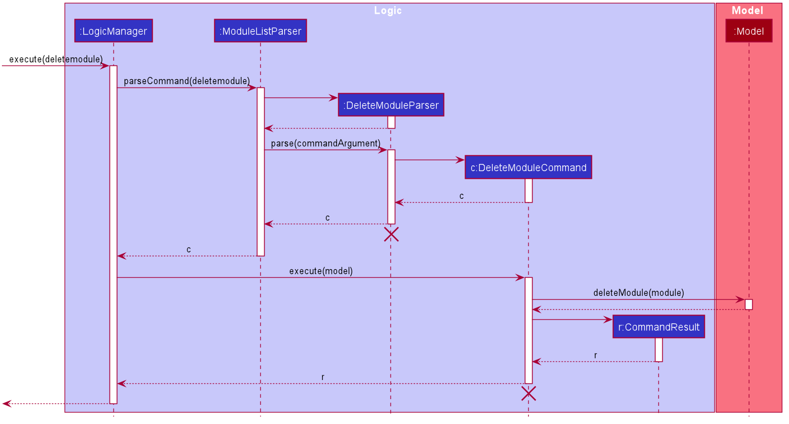

#### Design consideration:

##### Aspect: Method to delete module

* **Alternative 1 (current choice):** Delete a `Module` based on its index in the displayed `ModuleList`
  * Pros: Using the `Module` index allows us to uniquely identify the target `Module` to delete, reducing the room for possible error
  * Cons: The target `Module` to be deleted might not be displayed on the `ModuleList` and hence the `Module` index might not be
          readily available. This can inconvenience users who have to search for the `Module` to retrieve the `Module` index

* **Alternative 2:** Delete a `Module` based on the `Module` name
  * Pros: It can make the deletion process simpler for **users** who can provide the name of the `Module` without having to execute more commands
  * Cons: This is more difficult to implement

Alternative 1 was chosen since it is easier to implement and it makes the command simpler for users to input.

#### Edit Module Feature

The edit module feature edits a pre-existing `Module` in the `ModuleList` using `Module` details provided by the user.
This feature is facilitated by the following classes:

  * `EditModuleParser`: 
    * It implements `EditModuleParser#parse()` to parse and validate the provided `Module` details and `Module` index

  * `EditModuleDescriptor`:
    * It stores the `Module` details which will be used to edit the target `Module`

  * `EditModuleCommand`:
    * It implements `EditModuleCommand#execute()` to edit the `Module` in `Model`

Given below is an example usage scenario and how the mechanism for editing a `Module` behaves at each step:
Step 1. `LogicManager` receives the user input `editmodule 1 n/CS2100 mc/4.0 gp/5.0 t/Coremodule ` from `Ui`

Step 2. `LogicManager` calls `ModuleListParser#parseCommand()` to create an `EditModuleParser`

Step 3. Additionally, `ModuleListParser` will call the `EditModuleParser#parse()` method to parse the command arguments

Step 4. This creates an `EditModuleCommand` and `EditModuleCommand#execute()` will be invoked by `LogicManager` to edit the target `Module`

Step 5. The `Model#setModule()` operation exposed in the `Model` interface is invoked to replace the target `Module` with the edited `Module`

Step 6. A `CommandResult` from the command execution is returned to `LogicManager`

Given below is the sequence diagram of how the operation to edit a `Module` works:
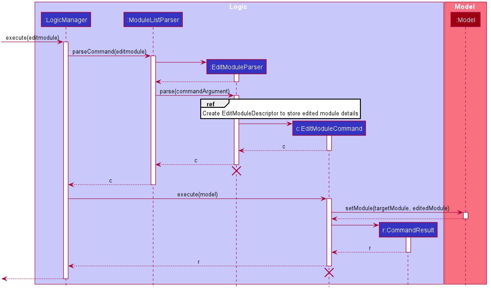

#### Design consideration:

##### Aspect: Implementation of `EditModuleCommand`

* **Alternative 1 (current choice):** 
  * Pros: Reduces coupling between the command classes and `EditModuleCommand` can be implemented without restrictions,
          or a need to consider how it might affect the other command classes
  * Cons: Additional methods have to be implemented to replace the target module with the edited module

* **Alternative 2:** Reuse `DeleteModuleCommand` to delete the target `Module` and `AddModuleCommand` to add the edited `Module`
  * Pros: Reusing other commands would make the implementation of `EditModuleCommand` simpler and easier
  * Cons: It increases coupling between the 3 commands and this can cause issues in `EditModuleCommand` if either 
          `DeleteModuleCommand` or `AddModuleCommand` developed bugs or errors. Also, it might affect performance since 
          executing `EditModuleCommand` will execute 2 other commands

Alternative 1 was chosen since it gave more freedom with regard to the implementation of `EditModuleCommand` since
we were not restricted to reusing other commands. Less coupling between the classes meant that changes in one class would 
less likely require changes to other classes.

#### Find Module Feature

The find `Module` feature is important since sieving through all modules to search for a specific `Module` can be 
tedious and not user-friendly.

The find `Module` feature searches for modules using the `Module` name.
For each search parameter, modules have to match at least one keyword to fulfil the search criteria.

This feature is facilitated by the following classes:

  * `FindModuleParser`:
    * It implements `FindModuleParser#parse()` to parse and validate the user input
    * It creates `NameContainsKeywordsPredicate` objects using the command arguments
   
  * `FindModuleCommand`:
    * It implements `FindModuleCommand#execute()` to find all matching modules by updating the 
      filtered displayed module list in `Model` using the `NameContainsKeywordsPredicate` from `FindModuleParser`

Given below is an example usage scenario and how the mechanism for finding `Module` behaves at each step:
Step 1. `LogicManager` receives the user input `findmodule CS2100` from `Ui`

Step 2. `LogicManager` calls `ModuleListParser#parseCommand()` to create a `FindModuleParser`

Step 3. Additionally, `ModuleListParser` will call the `FindModuleParser#parse()` method to parse the command arguments

Step 4. This creates a `NameContainsKeywordsPredicate` that will be used to obtain the filtered displayed `ModuleList`

Step 5. Additionally, a `FindModuleCommand` is created and `FindModuleCommand#execute()` will be invoked by `LogicManager` to find matching modules

Step 6. The `Model#updateFilteredModuleList()` operation exposed in the `Model` interface is invoked to update the displayed `ModuleList`
        using `NameContainsKeywordsPredicate`

Step 7. A `CommandResult` from the command execution is returned to `LogicManager`

Given below is the sequence diagram of how the operation to find modules works:
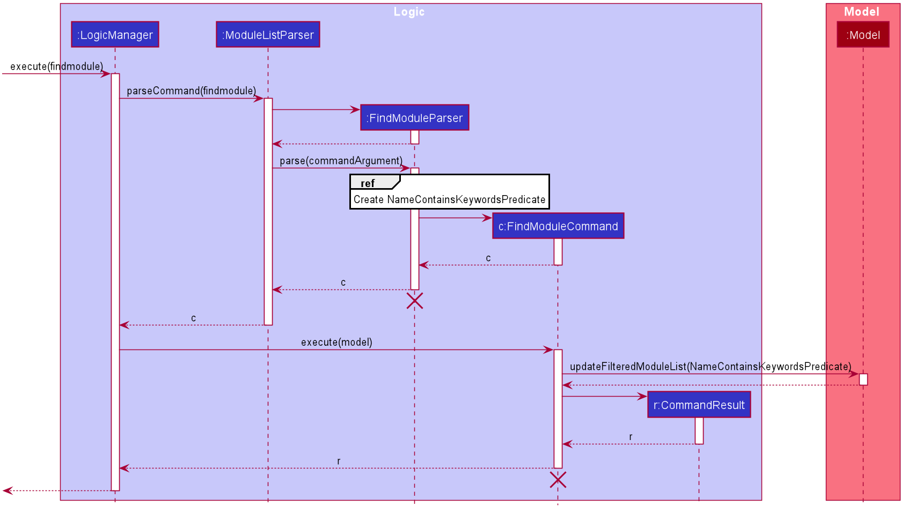
Fig ??

#### Module list data archiving

##### Implementation

The module list data archiving function is facilitated by `ModelManager`. It keeps track of a additional `ModuleList` which stores archived modules as
compared the the current `ModuleList` that stores currently relevant modules. Additionally, it implements the following operations:

* `ModelManager#archiveModule()` - Archives a module by removing it from the current `ModuleList` and placing it in the archived `ModuleList`.

* `ModelManager#unarchiveModule()` - Un-archives a module by removing it from the archived `ModuleList` and placing it in the current `ModuleList`.

The following sequence diagram shows how the archive module operation works:

:information_source: **Note:** The lifeline for `ArchiveModuleCommand`
should end at the destroy marker (X) but due to a limitation of PlantUML, the lifeline reaches the end of diagram.

The `unarchivemodule` command does the opposite — it calls `Model#unarchiveModule()`, which removes the specified module  from the archived `ModuleList` and placing it in the current `ModuleList`.

### Module Assignment 
In order for CAP 5 Buddy to properly support the students study, information of the students grades assignments and results should be kept.
This would allow the student to adequately assess the current grades that he or she currently has. With knowledge of the grades already achieved for the module
CAP 5 Buddy can calculate the current percentage and results for the student so that the student can understand how close he or she
is to their next grade.

The section below provides details on the implementation of each assignment related function and design considerations of these features.

### Details of implementation

The model below shows the implementation of the `GradeTracker` that is stored under the `Module` class.
Each `Module` can only have one `GradeTracker` which manages the assignments under that module.
The `GradeTracker` stores a `UniqueAssignmentList` that ensures assignments within the list are not duplicates of each other.
Each `Assignment` contains the following three fields: an `AssignmentName`, `AssignmentPercentage` and `AssignmentResult`.

The list of all `GradeTracker` related features are:
1. Add an Assignment: Adds a new assignment to the `GradeTracker`.
2. Edit an Assignment: Edits a pre-existing assignment in the `GradeTracker`.
3. Delete an Assignment: Deletes a pre-existing assignment in the `GradeTracker`.
4. Add a Grade: Adds a grade for the overall module.

#### Add Assignment Feature

This feature creates and adds a new `Assignment` to the `GradeTracker` of a `Module`. This action
is only allowed if the `Assignment` does not already exist in the `GradeTracker`.

This feature is facilitated by the following classes:

* `AddAssignmentParser`:
  * It implements `AddAssignmentParser#parse()` to validate and parse the module name and assignment details.
* `AddAssignmentCommand`:
  * It implements `AddAssignmentCommand#execute()` which executes the creation of the `Assignment` and adds the
  assignment to the module identified by the `ModuleName` that was parsed.

When an `assignment` is added, it follows the sequence diagram as shown below. The sequence flows similarly 
to the rest of the project as the command is parsed and then executed.

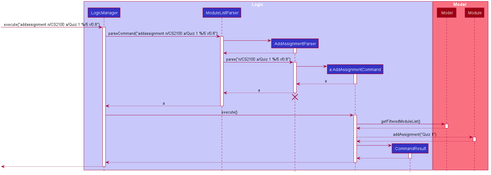

Given below is an example usage scenario and how the mechanism for adding an `Assignment` behaves at each step:

Step 1. `LogicManager` receives the user input `addassignment n/CS2100 a/Quiz 1 %/20 r/85` from `Ui`

Step 2. `LogicManager` calls `GradeTrackerParser#parseCommand()` to create a `AddAssignmentParser`

Step 3. Additionally, `AddAssignmentParser` will call the `AddAssignmentParser#parse()` method to parse the command arguments

Step 4. An `AddAssignmentCommand` is created and the command arguments are passed to it.

Step 5.  `AddAssignmentCommand#execute()` will be evoked by `LogicManager` to creates an `Assignment` using the parsed inputs, `Quiz 1` for `AssignmentName`, `20` for `AssignmentPercentage`
and `85` for `AssignmentResult`. A `ModuleName` is also created using the input `CS2100`.

Step 6. The `Module` is searched for through the `Model#getFilteredModuleList()` and when it is found, the
`Module#addAssignment()` is executed with the `Assignment`, adding the assignment to the module's `GradeTracker`.

Step 7. A `CommandResult` from the command execution is returned to `LogicManager`

#### Design consideration:

##### Aspect: Whether to directly store the assignments under module
* Alternative 1 : Module stores assignments directly without any association class.
    * Pros : Less work to be done.
    * Cons : Less OOP.
    
* Alternative 2 (current choice): Module stores a separate class that then stores the assignments
    * Pros : More OOP and the assignments are less coupled to the Module.
    * Cons : Takes more effort and complexity to recreate the unique object list within another layer(`Module`).
    
We implemented the second option despite its difficulty and complexity, taking more time to carry out as we felt
that this feature was major enough to warrant the time and depth to implement.

####Edit Assignment Feature

This feature allows `assignments` within a `GradeTracker` to be edited. The fields that can be edited are the
`AssignmentName`, `AssignmentPercentage` and its `AssignmentResult`. The grade tracker of the module to act on must
currently have a valid assignment to target.

This feature requires the following classes:

* `EditAssignmentDescriptor`:
  * It represents and encapsulates the edited assignment and stores the fields to replace the current ones.
* `EditAssignmentParser`:
  * It implements `EditAssignmentParser#parse()` to validate and parse the assignment `Index`, module name and assignment
  edited details, creating an `EditAssignmentDescriptor` object with the edited details.
* `EditAssignmentCommand`:
  * It implements `EditAssignmentCommand#execute()` which will execute the editing of the assignment at the corresponding
  assignment `Index` in the corresponding `Module` identified by the parsed module name.

Given below is an example usage scenario and how the mechanism for editing an `Assignment` behaves at each step:

Step 1. `LogicManager` receives the user input `editassignment 1 n/CS2100 a/Quiz 1` from `Ui`

Step 2. `LogicManager` calls `GradeTrackerParser#parseCommand()` to create a `EditAssignmentParser`

Step 3. Additionally, `EditAssignmentParser` will call the `EditAssignmentParser#parse()` method to parse the command arguments

Step 4. An `EditAssignmentCommand` is created and the command arguments are passed to it.

Step 5. `EditAssignmentCommand#execute()` will be evoked by `LogicManager` to creates an `EditAssignmentDescriptor`
using the parsed inputs, `Quiz 1` for `AssignmentName`. A `ModuleName` is also created using the input `CS2100`.

Step 6. The `Module` is searched for through the `Model#getFilteredModuleList()` and when it is found, the
`Module#setAssignment()` is executed with the `Assignment`, adding the assignment to the module's `GradeTracker`.

Step 7. A `CommandResult` from the command execution is returned to `LogicManager`

#### Design consideration:

##### Aspect: Whether to directly store the assignments under module
* Alternative 1 : Module stores assignments directly without any association class.
    * Pros : Less work to be done.
    * Cons : Less OOP.
    
* Alternative 2 (current choice): Module stores a separate class that then stores the assignments
    * Pros : More OOP and the assignments are less coupled to the Module.
    * Cons : Takes more effort and complexity to recreate the unique object list within another layer(`Module`).
    
We implemented the second option despite its difficulty and complexity, taking more time to carry out as we felt
that this feature was major enough to warrant the time and depth to implement.

### Cap Calculator

#### Calculate CAP Feature

The calculate CAP function is facilitated by `CalculateCapCommand`. It extends Command with a counter for total
grade points and modular credits, both stored internally `gradePoints` and `modularCredits` respectively. Additionally, it implements the following operations:

* `CalculateCapCommand#calculateCap()` - Calculates CAP using data from modules tagged as completed in current `ModuleList` and archived `ModuleList`.

The following sequence diagram shows how the calculate cap operation works:

:information_source: **Note:** The lifeline for `CalculateCapCommand`
should end at the destroy marker (X) but due to a limitation of PlantUML, the lifeline reaches the end of diagram.

#### Design consideration:

##### Aspect: Information used to calculate cap
* Alternative 1 (current choice): Calculates based on academic information on mods tagged as completed.
    * Pros : Easy to implement.
    * Cons : User has to manually input every module to be used as data for calculation.

* Alternative 2 : Prompts user for academic information used for last calculated cap and stores it.
    * Pros :
     * User does not need to input unnecessary modules.
     * Will use less memory.(e.g Modules that the user is not currently taking does not need to be added by user).
    * Cons : Will require additional storage.
    
#### Calculate target CAP details Feature

The calculate CAP function is facilitated by `TargetCapCalculatorCommand`. It extends Command. Additionally, it implements the following operations:

* `TargetCapCalculatorCommand#calculateCapNeeded()` - Calculates CAP needed for planned modules for user to achieve input target CAP using data from modules in current `ModuleList` and archived `ModuleList`.

The following sequence diagram shows how the target cap operation works:
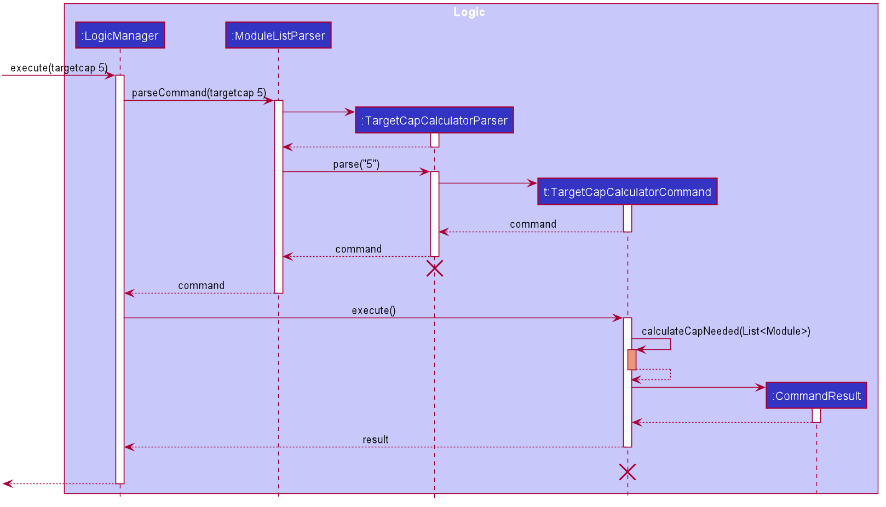

:information_source: **Note:** The lifeline for `CalculateCapCommand`
should end at the destroy marker (X) but due to a limitation of PlantUML, the lifeline reaches the end of diagram.

### Zoom Link Management

As Cap 5 Buddy is designed to suit the needs of SoC students during the transition to online learning,
it is crucial to design features which allows efficient management of zoom links which are widely used during
online learning. However, it is worth noting that these features can be easily modified to manage any website links,
showcasing the usefulness of these features beyond online learning.

The section below provides details of the implementation of each zoom link related function and design considerations
of these features.

#### Details of implementation

##### Add zoom link feature

This feature creates and adds a new `ZoomLink` for a `ModuleLesson` into a specific `Module`, if the 
zoom link does not already exist in the module. Each `ModuleLesson` in a `Module` is only allowed to have one `ZoomLink`.

This feature is facilitated by the following classes:
  * `AddZoomLinkParser`:
    * It implements `AddZoomLinkParser#parse()` to validate and the parse the module index and zoom link details, and creates
      a `ZoomDescriptor` object.
  * `ZoomDescriptor`:
    * It stores and encapsulates the `ZoomLink` and `ModuleLesson` objects which will be added to the specified `Module`
  * `AddZoomLinkCommand`:
    * It implements `AddZoomLinkCommand#execute()` which executes the addition of the `ZoomLink` and its corresponding
      `ModuleLesson` into the `Module` encapsulated in `Model`
      
Given below is an example usage scenario and how the mechanism for adding zoom links behaves at each step:
Step 1. `LogicManager` receives the user input `addzoom 1 n/Lecture z/https://nus-sg.zoom.us/link` from `Ui`
Step 2. `LogicManager` calls `ModuleListParser#parseCommand()` to create an `AddZoomLinkParser`
Step 3. Additionally, `ModuleListParser` will call the `AddZoomLinkParser#parse()` method to parse the command arguments
Step 4. This creates an `AddZoomLinkCommand` using a `ZoomDescriptor` object that encapsulates the `ZoomLink` and `ModuleLesson` to be added
Step 5. `AddZoomLinkCommand#execute()` will be invoked by `LogicManager` to create
        the updated `Module` with the added `ZoomLink` and `ModuleLesson` by calling the `Module#addZoomLink()` method
Step 5. The `Model#setModule()` operation exposed in the `Model` interface is invoked to replace the target module with the updated module containing the newly added zoom link
Step 6. A `CommandResult` from the command execution is returned to `LogicManager`

Given below is the sequence diagram of how the operation to add a zoom link works:
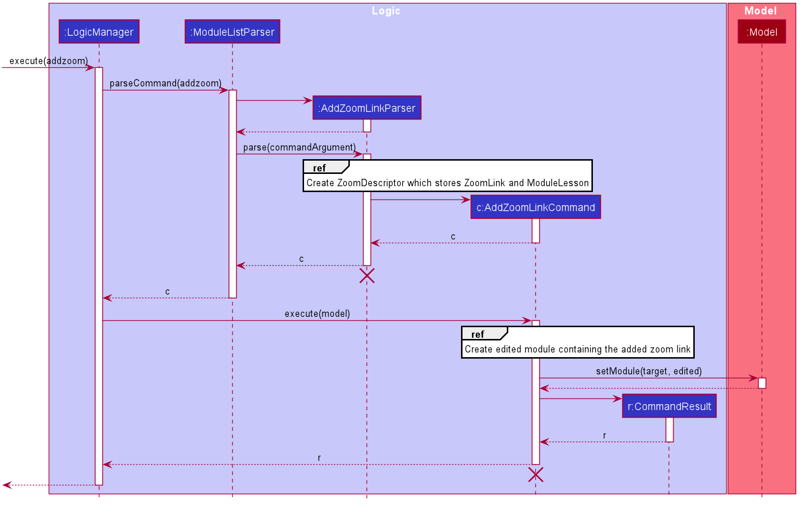

:information_source: **Note:** The lifeline for `AddZoomLinkCommand` and `AddZoomLinkParser` should end 
at the destroy marker (X) but due to a limitation of PlantUML, the lifeline reaches the end of diagram.

The following activity diagram summarizes what happens when a user executes the `AddZoomLinkCommand`:
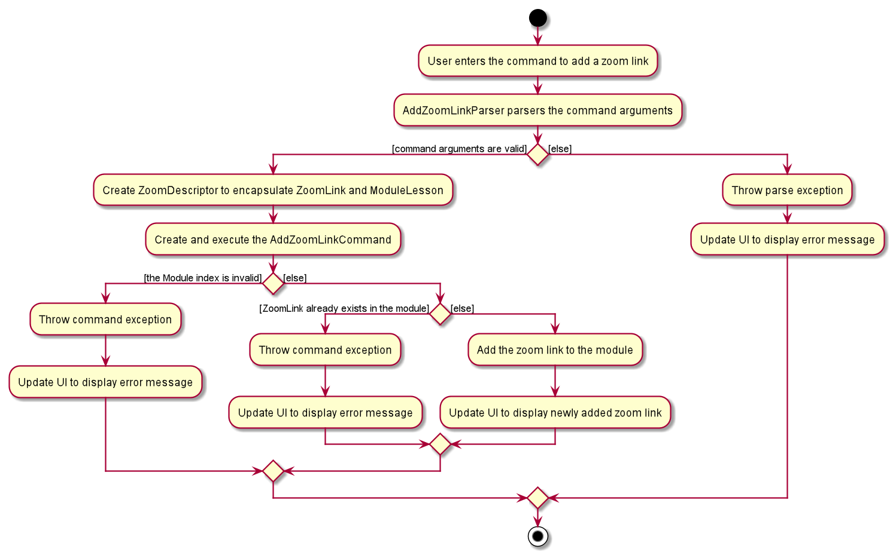

##### Design consideration:

##### Aspect: How to encapsulate zoom links and module lesson fields

* **Alternative 1:** Store zoom link and module lesson as strings 

  * Pros: Easier to implement as we do not need to create extra classes to encapsulate these objects.
  * Cons: Does not adhere to OOP principles as higher level classes such as `Parser` need to be aware of lower level details, such 
          as the regular expression of a zoom link.

* **Alternative 2 (current choice):** Create classes to represent `ZoomLink` and `ModuleLesson` objects

  * Pros: Adheres strongly to OOP principles as we are able to abstract out the lower level details of `ZoomLink` and `ModuleLesson` into their respective classes.
          We will be able to better demonstrate the behaviour of the respective `ZoomLink` and `ModuleLesson` objects.
          It facilitates future development of the project if zoom link or module lesson were to have certain states or behaviour that have to be implemented. 
  * Cons: Additional classes have to be implemented to encapsulate zoom link and module lesson. These classes may appear to be
          unnecessary since zoom link and module lesson do not currently have significant states or behaviour.

Alternative 1 was chosen since it followed OOP principles which is a good practice in a SE project. Also, it provides
greater flexibility for expansion of the project.

##### Delete zoom link feature

This feature deletes an existing zoom link from a module using the module lesson that is mapped to the
target zoom link.

This feature is facilitated by the following classes:
  
  * `DeleteZoomLinkParser`:
    * It implements `DeleteZoomLinkParser#parse()` to validate and parse the module index and module lesson provided by the user.
  * `DeleteZoomLinkCommand`:
    * It implements `DeleteZoomLinkCommand#execute()` to delete the zoom link from the module 
      using the unique module lesson that is mapped to the target zoom link.  
      
Given below is an example usage scenario and how the mechanism for deleting zoom links behaves at each step:
Step 1. `LogicManager` receives the user input `deletezoom 1 n/Lecture` from `Ui`
Step 2. `LogicManager` calls `ModuleListParser#parseCommand()` to create an `DeleteZoomLinkParser`
Step 3. Additionally, `ModuleListParser` will call the `DeleteZoomLinkParser#parse()` method to parse the command arguments
Step 4. This creates a `DeleteZoomLinkCommand` and `DeleteZoomLinkCommand#execute()` will be invoked by `LogicManager` 
Step 5. This deletes the target zoom link identified by its unique module lesson using the `Module#deleteZoomLink()` method.
Step 6. The `Model#setModule()` operation exposed in the `Model` interface is invoked to replace the target module with the updated module
Step 7. A `CommandResult` from the command execution is returned to `LogicManager`

##### Design consideration:

##### Aspect: Limit on the number of zoom links that can be mapped to each module lesson

* **Alternative 1 (current choice):** Each module lesson can only be mapped to a single zoom link
  * Pros: The execution of a zoom link command is less complicated as each zoom link is uniquely identified by its module lesson. 
          The implementation of the command is easier as we only need to identify the correct module lesson and
          remove the key value pair from the hashmap.
  * Cons: Creates a restriction for users as they are only allowed to add one zoom link for each module lesson.

* **Alternative 2:** Each module lesson can be mapped to multiple zoom links
  * Pros: This creates more freedom and flexibility for users to add multiple zoom links for the same lesson.
  * Cons: Locating the specific zoom link to remove is tedious as we have to iterate through the list of zoom links that are mapped to the module lesson. 
          Additionally, we need to implement a mechanism to allow users to specify the exact zoom link to be deleted since using the module
          name is not sufficient.

Alternative 1 was chosen as it was significantly simpler to implement and did not violate any key design principles.
We also took into consideration the fact that it is unlikely for a single lesson to have multiple zoom links.

##### Edit zoom link feature

This feature edits an existing zoom link in a module using the module lesson that is mapped to the
target zoom link.

This feature is facilitated by the following classes:

  * `EditZoomLinkParser`:
    * It implements `EditZoomLinkParser#parse()` to validate and parse the module index, module lesson and edited zoom link provided by the user.
      This creates a `ZoomDescriptor` object that stores the zoom link details needed for the edit zoom link command.
    
  * `ZoomDescriptor`  
    * It stores and encapsulates the `ZoomLink` and `ModuleLesson` objects which will be used to execute the command to edit the zoom link 
    
  * `EditZoomLinkCommand`:  
    * It implements `EditZoomLinkCommand#execute()` which edits the target zoom link in the specified module encapsulated in `Model`
   

Given below is an example usage scenario and how the mechanism for editing zoom links behaves at each step:
Step 1. `LogicManager` receives the user input `editzoom 1 n/Lecture z/https://nus-sg.zoom.us/newLink` from `Ui`
Step 2. `LogicManager` calls `ModuleListParser#parseCommand()` to create an `EditZoomLinkParser`
Step 3. Additionally, `ModuleListParser` will call the `EditZoomLinkParser#parse()` method to parse the command arguments
Step 4. This creates an `EditZoomLinkCommand` using a `ZoomDescriptor` object that encapsulates the edited zoom link
Step 5. `EditZoomLinkCommand#execute()` will be invoked by `LogicManager` to create
        the updated `Module` with the edited `ZoomLink` by calling the `Module#editZoomLink()` method
Step 5. The `Model#setModule()` operation exposed in the `Model` interface is invoked to replace the target module with the updated module containing the edited zoom link
Step 6. A `CommandResult` from the command execution is returned to `LogicManager`   

The sequence diagram of how the operation to edit a zoom link works is similar to the one in figure ?.?, 
except that the respective parser and command classes are `EditZoomLinkParser` and `EditZoomLinkCommand`

##### Design consideration:

##### Aspect: How to implement the command to edit zoom link

* **Alternative 1:** Reuse the same `Parser` and `Command` classes used by the `AddZoomLink` command to implement the `EditZoomLink` command at the same time 
                     since the two commands have very similar implementations.

  * Pros: Reduces the amount of code that has to be written, as well as the number of classes that have to be implemented. 
  * Cons: Violates the **Single Responsibility Principle** since the same parser and command classes have 2 separate responsibilities and have to perform 2 different operations.

* **Alternative 2 (current choice):** Implement the `EditZoomLink` command separately.

  * Pros: Adheres to the Single Responsibility Principle and it is easier to implement the function since we do not need to handle 
          2 separate commands at the same time.
  * Cons: Repetition of code may occur.
  
Alternative 2 was chosen since it was a good practice to follow key designing principles. Using alternative 1 would complicate
the implementation of the command since we had to handle 2 different cases and this can increase the occurrences of bugs.

##### Aspect: Data structure to support zoom link commands

* **Alternative 1 (current choice):** Use a `HashMap` to store module lesson and zoom links in a module. Each module lesson
                                      will be used as a key which is mapped to a zoom link.
  * Pros: Checking for duplicate zoom links will be simpler.
  * Cons: Zoom links can only be uniquely identified by their module lesson. Any operation involving zoom link objects would
          require the module lesson that the zoom link is mapped to.
  
* **Alternative 2:** Encapsulate a zoom link object as a field of module lesson and use a `HashSet` to store module lesson objects.
  * Pros: It is easy to check for duplicate module lessons.
  * Cons: It is tedious to check for duplicate zoom links as we have to access the zoom link field of each module lesson in the hashset.
  
* **Alternative 3:** Encapsulate a zoom link object as a field of module lesson and use an `ArrayList` to store module lesson objects.
  * Pros: It is easy to identify module lessons by index. Users can provide the index of the module lesson for zoom link commands, 
          which is simpler compared to providing the module lesson name.  
  * Cons: The process of checking for duplicate module lessons and zoom links in the module is more tedious.

Alternative 1 was chosen since checking for duplicate zoom links occurs frequently during the execution of 
zoom link related commands.

### 3.2 Contact List Management

As a module tracking system, Cap 5 Buddy allows users to manage a list of module-related contacts with ease.
This is especially important since being enrolled in numerous modules results in the need to keep track of
numerous contacts, each with different contact details.

The section below provides details of the implementation of each Contact List function and design considerations
of these features.

#### Contact List Commands

Below is a list of all `Contact` related features:

1. Add a contact: Adds a new contact into the contact list
2. Delete a contact: Deletes a pre-existing contact from the contact list
3. Edit a contact: Edits a pre-existing contact in the contact list
4. Find a contact: Search for contacts using different search parameters

Given below is the class diagram of the `Contact` class:

Figure ?.? Class Diagram for Contact class

#### Details of implementation

##### Add contact feature

This feature creates and adds a new `Contact` into the contact list if the contact does not already exist. 

This feature is facilitated by the following classes:

 * `AddContactParser`:
   * It implements `AddContactParser#parse()` to parse and validate the user arguments to create a new `Contact`.

 * `AddContactCommand`:
   * It implements `AddContactCommand#execute()` which executes the addition of the new contact into `Model`.

Given below is an example usage scenario and how the mechanism for adding contact behaves at each step:
Step 1. `LogicManager` receives the user input `addcontact n/John e/john@gmail.com te/@johndoe` from `Ui`
Step 2. `LogicManager` calls `ContactListParser#parseCommand()` to create an `AddContactParser`
Step 3. Additionally, `ContactListParser` will call the `AddContactParser#parse()` method to parse the command arguments
Step 4. This creates an `AddContactCommand` and `AddContactCommand#execute()` will be invoked by `LogicManager` to excecute the command to add the contact
Step 5. The `Model#addContact()` operation exposed in the `Model` interface is invoked to add the new contact
Step 6. A `CommandResult` from the command execution is returned to `LogicManager`

Given below is the sequence diagram of how the operation to add a contact works:

Figure ?.? Sequence diagram for the execution of `AddContactCommand`

:information_source: **Note:** The lifeline for `AddContactCommand` and `AddContactParser` should end 
at the destroy marker (X) but due to a limitation of PlantUML, the lifeline reaches the end of diagram.

The following activity diagram summarizes what happens when a user executes the `AddContactCommand`:

Figure ?.? Activity diagram representing the execution of `AddContactCommand`

##### Design consideration:

##### Aspect: Require users to provide all contact fields when adding a new contact

* **Alternative 1 (current choice):** Require `ContactName` and `Email` to be mandatory fields that must be provided, while leaving `Telegram` as an optional field
  * Pros: This caters to certain contacts who do not have a `Telegram` field, providing more flexibility for users when creating contacts.
  * Cons: This can complicate the process of checking if 2 contacts are the same since we need to consider if the `Telegram` field of a contact 
          is present before the comparison is performed. 

* **Alternative 2:** Require `ContactName`, `Email` and `Telegram` to be mandatory fields
  * Pros: The process of checking if 2 contacts are the same by comparing all 3 contact fields will be simpler.
  * Cons: This can create problems for users who want to add a contact that does not have a suitable `Telegram` field

Alternative 1 was chosen since it provides users with greater freedom when creating contacts. Enforcing all contact fields to be 
mandatory can restrict users when adding contacts, hindering user experience.

#### Delete Contact Feature

The delete contact feature deletes a pre-existing `Contact` using the index of the contact on the displayed contact list.
This feature is facilitated by the following classes: 

  * `DeleteContactParser`:
    * It implements `DeleteContactParser#parse()` to parse and validate the contact ID

  * `DeleteContactCommand`:
    * It implements `DeleteContactCommand#execute()` to delete the `Contact` from `Model`

After the user input has been parsed by `DeleteContactParser`, `LogicManager` will execute the delete operation by invoking
`DeleteContactCommand#execute()`. This deletes the target contact by invoking the `Model#deleteContact()` method exposed in the `Model` interface.

Given below is the sequence diagram of how the operation to delete a contact works:

#### Design consideration:

##### Aspect: Method to delete contact

* **Alternative 1 (current choice):** Delete a contact based on its index in the displayed contact list
  * Pros: Using the contact index allows us to uniquely identify the target contact to delete, reducing the room for possible error
  * Cons: The target contact to be deleted might not be displayed on the contact list and hence the contact index might not be
          readily available. This can inconvenience users who have to search for the contact to retrieve the contact index.

* **Alternative 2:** Delete a contact based on the contact name
  * Pros: It can make the deletion process simpler for **users** who can provide the name of the contact without having to execute more commands.
  * Cons: This can complicate the deletion process since contacts with the same name is a possibility. If there are multiple
          contacts with the same provided name, more information of the target contact has to be provided by the user,
          creating more inconvenience for the user as well.

Alternative 1 was chosen since it guarantees a unique contact would be provided in every case. This ensures the
contact deletion process is safe and the correct contact is deleted, minimising the room for potential errors.  

#### Edit Contact Feature

The edit contact feature edits a pre-existing contact in the contact list using contact details provided by the users.
This feature is facilitated by the following classes:

  * `EditContactParser`: 
    * It implements `EditContactParser#parse()` to parse and validate the provided contact details and contact index

  * `EditContactDescriptor`:
    * It stores the contact details which will be used to edit the target contact

  * `EditContactCommand`:
    * It implements `EditContactCommand#execute()` to edit the contact in `Model`

Given below is an example usage scenario and how the mechanism for editing contact behaves at each step:
Step 1. `LogicManager` receives the user input `editcontact 1 n/John te/@johndoe` from `Ui`
Step 2. `LogicManager` calls `ContactListParser#parseCommand()` to create an `EditContactParser`
Step 3. Additionally, `ContactListParser` will call the `EditContactParser#parse()` method to parse the command arguments
Step 4. This creates an `EditContactCommand` and `EditContactCommand#execute()` will be invoked by `LogicManager` to edit the target contact
Step 5. The `Model#setContact()` operation exposed in the `Model` interface is invoked to replace the target contact with the edited contact
Step 6. A `CommandResult` from the command execution is returned to `LogicManager`

Given below is the sequence diagram of how the operation to edit a contact works:

#### Design consideration:

##### Aspect: How to encapsulate the edited contact details and relay this information to EditContactCommand

* **Alternative 1 (current choice):** Encapsulate all edited contact details in a class `EditContactDescriptor`
  * Pros: Reduces the complexity of the `EditContactCommand` class constructor as the number of parameters for the constructor
          is constant. It also reduces the level of coupling between `EditContactCommand` and `EditContactParser`
  * Cons: Additional method calls are require to store the edited contact details in `EditContactDescriptor` class.

* **Alternative 2:** Provide the edited contact details as arguments for the `EditContactCommand` constructor
  * Pros: Fewer method calls are required since `EditContactParser` can directly pass the edited contact arguments to the `EditContactCommand` constructor
  * Cons: This can increase data coupling between `EditContactParser` and `EditContactCommand` which can cause unnecessary changes in
          either class if the other class were to change.

Alternative 1 was chosen as it would make future changes to any class easier and less error-prone, 
hence increasing the ease of maintenance, since there was less coupling between the 2 classes.

##### Aspect: Implementation of `EditContactCommand`

* **Alternative 1 (current choice):** 
  * Pros: Reduces coupling between the command classes and `EditContactCommand` can be implemented without restrictions,
          or a need to consider how it might affect the other command classes
  * Cons: Additional methods have to be implemented to replace the target contact with the edited contact

* **Alternative 2:** Reuse `DeleteContactCommand` to delete the target contact and `AddContactCommand` to add the edited contact
  * Pros: Reusing other commands would make the implementation of `EditContactCommand` simpler and easier
  * Cons: It increases coupling between the 3 commands and this can cause issues in `EditContactCommand` if either 
          `DeleteContactCommand` or `AddContactCommand` developed bugs or errors. Also, it might affect performance since 
          executing `EditContactCommand` will execute 2 other commands.

Alternative 1 was chosen since it gave more freedom with regard to the implementation of `EditContactCommand` since
we were not restricted to reusing other commands. Less coupling between the classes meant that changes in one class would 
less likely require changes to other classes.

#### Find Contact Feature

The find contact feature is important since sieving through all contacts to search for a specific contact can be 
tedious and not user-friendly. Finding contacts using one search parameter is not meaningful 
as the search results might not be refined and accurate.

The find contact feature searches for contacts using 2 parameters: contact name and/or tag. 
For each search parameter, contacts have to match at least one keyword to fulfil that search criteria.
If multiple parameters are provided, e.g both name and tag keywords, only contacts that fulfil both the name and tag criteria are returned. 

This feature is facilitated by the following classes:

  * `FindContactParser`:
    * It implements `FindContactParser#parse()` to parse and validate the user input
    * It creates predicate objects using the command arguments and adds them to the list of predicates in
      `FindContactCriteria`
    * It implements `FindContactParser#isAtLeastOnePrefixPresent()` to validate that at least one search parameter was provided by the user

  * `FindContactCriteria`:
    * It encapsulates all the predicates which will be used to test for matching contacts
    * It implements the following operations:
      * `FindContactCriteria#addPredicate():` Adds a new predicate into the list of predicates 
         to test for matching contacts
      * `FindContactCriteria#getFindContactPredicate():` To compose all the predicates into a single predicate

    * Predicate objects that can be stored in `FindContactCriteria`:
      * `ContactNameContainsKeywordsPredicate`:
        * Tests if the name of a given contact matches at least one of the name keywords provided (case-insensitive)
      * `ContactContainsTagsPredicate`:
        * Tests if a given contact contains at least one of the search tags provided (case-insensitive)

  * `FindContactCommand`:
    * It implements `FindContactCommand#execute()` to find all matching contacts by updating the 
      filtered contact list in `Model` using the predicate from `FindContactCriteria`

Given below is an example usage scenario and how the mechanism for finding contact behaves at each step:
Step 1. `LogicManager` receives the user input `findcontact n/John t/friend` from `Ui`
Step 2. `LogicManager` calls `ContactListParser#parseCommand()` to create a `FindContactParser`
Step 3. Additionally, `ContactListParser` will call the `FindContactParser#parse()` method to parse the command arguments
Step 4. This creates a `FindContactCriteria` that encapsulates the created `Predicate` objects to test for matching contacts
Step 4. Additionally, a `FindContactCommand` is created and `FindContactCommand#execute()` will be invoked by `LogicManager` to find matching contacts
Step 5. The `Model#updateFilteredContactList()` operation exposed in the `Model` interface is invoked to update the displayed contact list 
        using the predicate from `FindContactCriteria`
Step 6. A `CommandResult` from the command execution is returned to `LogicManager`

Given below is the sequence diagram of how the operation to find contact works:
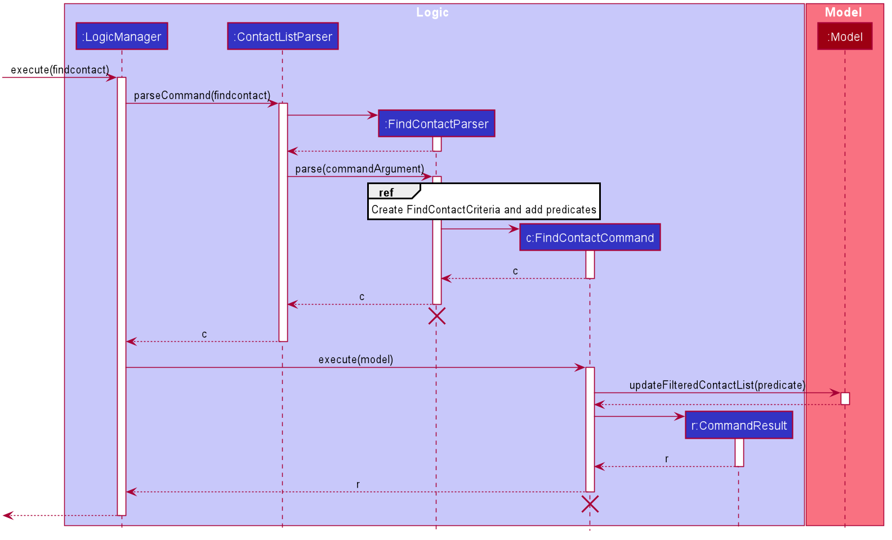
Fig ??

Given below is the sequence diagram showing the interaction between `FindContactParser` and `FindContactCriteria`:
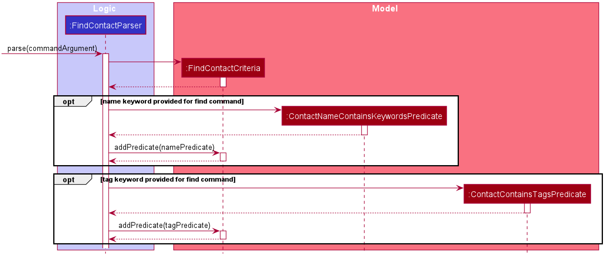

#### Design consideration:

##### Aspect: Storing of predicates in `FindContactCriteria`

* **Alternative 1 (current choice):** Store the predicates as a list of predicates
  * Pros: Composing the predicates into a single predicate is easier as we can simply iterate through the list
          and compose all the predicates.
  * Cons: Using a list means that the exact predicate objects in the list are not known. This can make testing and
          debugging more complicated. Moreover, we need to enforce checks on the predicate ensure that
          null objects, which can cause `NullPointerException` to be thrown, are not added.

* **Alternative 2:** Store each predicate object as an individual field of `FindContactCriteria`
  * Pros: Facilitates easier testing as we can accurately determine which predicate objects are present.
  * Cons: It is tedious to compose the predicates into a single predicate as we have to check each individual field and 
          determine if it is null of if the predicate exists. 

##### Aspect: Implementation of `FindContactCommand` 

* **Alternative 1 :** Implement separate find contact commands for each possible search parameter. In this case, to find contacts, 
                      we can create a command to find contacts by name, and another to find by tags.
  * Pros: Implementation of the commands would be more straightforward, as only one predicate has to be created for each
          find contact command. The `FindContactCriteria` class to store all the predicates would not be necessary in this case.
  * Cons: This can increase the number of different find contact commands which can cause confusion for users.
          Additionally, this can lead to repetitive code since the implementation of each find contact command would be similar.      

* **Alternative 2 (current choice):** Implement a single `FindContactCommand` which can search for contacts using all the possible search parameters.
                                      All the predicates needed to test for matching contacts would be encapsulated in `FindContactCriteria` 
  * Pros: Reduces the need for multiple find contact commands with similar implementations. Users can make more refined and
          accurate searches by combining multiple search parameters.
  * Cons: Increases the complexity of implementing `FindContactParser` which has to validate and parse multiple search 
          parameters provided.

### 3.3 TodoList feature

#### Implementation

The TodoList feature has two main component :

* **Containee component** (Task-related classes)
  * `Class Task` - container class to store information about a task
  * `Class TaskName` - wrapper class to store the name of a task
  * `Class Date` - wrapper class to store the date/deadline of a task
  * `Enum Priority` - enum class to represent priority of a task
  * `Enum Status` - enum class to represent the progress status of a task

* **Container component** (List-like classes)
  * Class `UniqueTodoList` - container class for storing tasks
  * Class `TodoList` - wrapper class for UniqueTodoList
  * Interface `ReadOnlyTodoList` - interface for displaying the list on the GUI

##### Containee Component

The Task class mainly functions as a class to store all the informations related to a task i.e. name, tag, priority,
date, and status. It does not have any subclasses.

The Task class supports the following operations :

* Setters for all the field
* Getters for all the field
* `Task#isSameTask()` - checks if two tasks are the same i.e. have the same name
(weaker than Task#equals() which requires all the fields to be the same)
* `Task#hasSameTag()` - checks if the task has the specified tag
* `Task#hasSamePriority()` - checks if the task has the specified priority
* `Task#hasSameDate()` - checks if the task has the specified date

##### Container Component

The TodoList class is facilitated by UniqueTodoList. The UniqueTodoList is stored internally inside
the TodoList class which act like a wrapper class.

The TodoList class supports the following operations :

* `TodoList#resetData()` - replaces all data in TodoList with new data.
* `TodoList#hasTask()` - checks if the specified task exist in the list.
* `TodoList#addTask()` - adds a task to the list.
* `TodoList#setTask()` - replaces a task with the specified task.
* `TodoList#removeTask()` - removes the specified task from the list.

The operations above are exposed in the Model interface as :

* `Model#hasTask()`
* `Model#addTask()`
* `Model#setTask()`
* `Model#deleteTask()`

TodoList implements ReadOnlyTodoList which require the following operation :

* `ReadOnlyTodoList#getTodoList()` - returns an ObservableList with type Task that is immutable, and we cannot
  modify the elements.

#### Design Consideration

##### Aspect: Task type

* Alternative 1 (current):  
  Use one concrete class i.e. Task without inheritance involved. The type of the task
  is represented by the Tag field instead.

  Pros :
  * Easier to implement
  * Types are not pre-defined i.e. can simply add a different tag to represent different type of task

  Cons :
  * All type of task have the same pre-defined field

* Alternative 2 :  
  Use one abstract class i.e. Task with inheritance. Each subclasses represent a type of a Task.

  Pros :
  * Difference between type are clear and standardized
  * Can be considered more OOP

  Cons :
  * Types must be pre-defined i.e. cannot add new type of classes without adding codes

  Alternative 1 is chosen since we prioritize user freedom to create custom type for the task.

  

#### Find Task Feature

The find task feature is crucial as it enables users to retrieve tasks efficiently rather than having to scan through their
entire todo list to find the desired task. This can also contribute to a better management of user tasks which is important since Cap 5 Buddy
is an application to track module related details and information. To ensure that searching for tasks is refined and accurate, this feature enables users to search using multiple parameters.

The search parameters that can be used to find tasks include: `Name`, `Date`, `Tag`, `Priority` and `Status`. If multiple search
parameters are provided by users, only tasks that fulfil all the search criteria will be returned.

This feature is facilitated by the following classes:

  * `FindTaskParser`:
    * It implements `FindTaskParser#parse()` to parse and validate the user input
    * It creates predicate objects using the command arguments and adds them to the list of predicates in
      `FindTaskCriteria`
    * It implements `FindTaskParser#isAtLeastOnePrefixPresent()` to validate that at least one search parameter was provided by the user
    
  * `FindTaskCriteria`:
    * It encapsulates all the predicates which will be used to test for matching tasks
    * It implements the following operations:
      * `FindTaskCriteria#addPredicate():` Adds a new predicate into the list of predicates 
        to test for matching contacts
      * `FindTaskCriteria#getFindTaskPredicate():` To compose all the predicates into a single predicate
        
  * Predicate objects that can be stored in `FindTaskCriteria`:
    * `TaskNameContainsKeywordsPredicate`:
      * Tests if the name of a given task matches at least one of the name keywords provided (case-insensitive)
    * `ContactContainsTagsPredicate`:
      * Tests if a given task contains at least one of the search tags provided (case-insensitive)
    * `TaskMatchesDatePredicate`:
      * Tests if the date of a given task matches the search date exactly.
    * `TaskMatchesPriorityPredicate`:
      * Tests if the priority of a given task matches the search priority exactly.
    * `TaskMatchesStatusPredicate`:
      * Tests if the status of a given task matches the search status exactly.
  
Given below is the class diagram describing the `FindTaskCriteria` class:
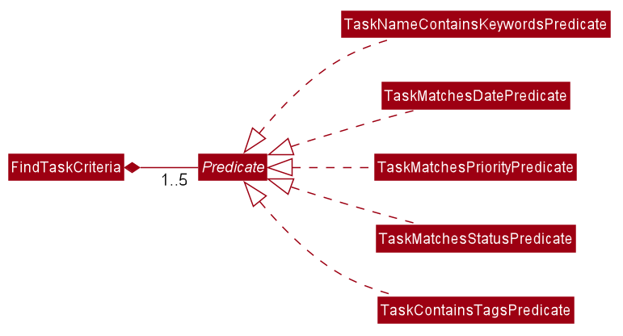

   * `FindTaskCommand`:
     * It implements `FindTaskCommand#execute()` to find all matching tasks by updating the 
       filtered todo list in `Model` using the predicate from `FindTaskCriteria`
       
Given below is an example usage scenario and how the mechanism for finding tasks behaves at each step:

Step 1. `LogicManager` receives the user input `findtask n/lab d/2020-01-01` from `Ui`

Step 2. `LogicManager` calls `TodoListParser#parseCommand()` to create a `FindTaskParser`

Step 3. Additionally, `TodoListParser` will call the `FindTaskParser#parse()` method to parse the command arguments

Step 4. This creates a `FindTaskCriteria` that encapsulates the created `Predicate` objects to test for matching tasks

Step 4. Additionally, a `FindTaskCommand` is created and `FindTaskCommand#execute()` will be invoked by `LogicManager` to find matching tasks

Step 5. The `Model#updateFilteredTodoList()` operation exposed in the `Model` interface is invoked to update the displayed todo list 
        using the predicate from `FindTaskCriteria`

Step 6. A `CommandResult` from the command execution is returned to `LogicManager`

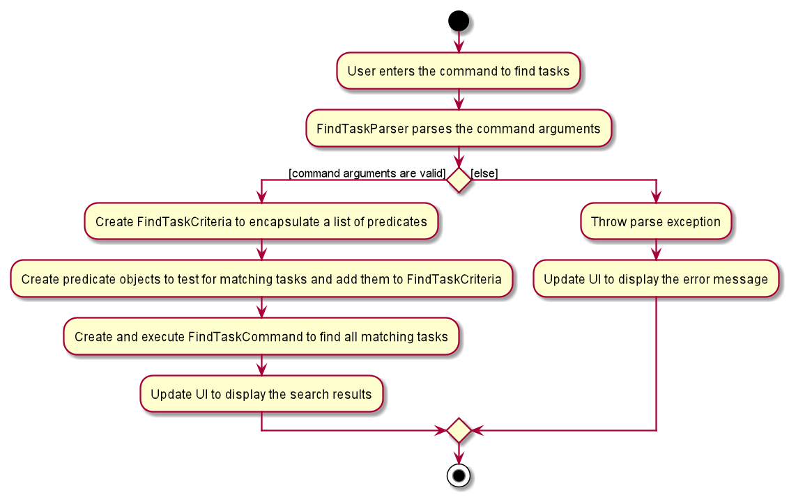

#### Design consideration:

##### Aspect: How to handle instances when the user does not provide any search parameter

* **Alternative 1 :** Allow users to provide 0 search parameters, in which case the find task command does not perform any operation.
  
  * Pros: Implementation of the command is simpler as we do not need to check if at least one search parameter was provided.
  * Cons: The command does not perform any meaningful operation.
  
* **Alternative 2 (current choice):** Handle instances when no search parameter was provided using exceptions and inform users that at least one parameter is required.

  * Pros: Ensures that users are aware of any constraints related to the command.
  * Cons: The implementation of the command is slighly more complex since exception handling is required and 
          we need to check if at least one search parameter was provided.

Alternative 2 was chosen as it conformed with the standard practice of handling errors using exception. Moreover, it removes any room for 
ambiguity by ensuring all constraints related to the command are made known to the users.
    
### 3.4 Event list management feature

### Add Event Feature

#### Implementation
The way this feature is currently implemented is similar to that of AB3. In the `Logic` component, we are using a specialised parser called
`SchedulerParser` that is currently set to handle all event related commands called by the user. This parser will activate the *_AddEventParser_*
that works similarly to AB3, returning the `AddEventCommand` that is executed in the `LogicManager`. Similar to AB3 and Module Tracker, the addevent
command will create the event based on the given user input and add that to the `EventList` to be stored.

This command is being facilitated by two supporting classes, `EventName` and `EventTime`. `EventName` is a logic container that contains the name of the
event to be created, and `EventTime` is the logic container for holding the date and time set by the user, as a LocalDateTime object. These two
classes are used in the creation of an `Event`, as the `Event` Object will take in a `EventName` and `EventTime`.

This is how Add Event works: 
Step 1. `LogicManager` takes the user input from the `UiManager` and checks the command word to decide which parser to pass onto. 
Step 2. `ParserManager` then selects `SchedulerParser` based on the command word. 
Step 3. `SchedulerParser` takes the user input and separate the command word from the arguments. 
Step 4. Based on the command word, the switch case selects the `AddEventParser` and passes the arguments into the parser. 
Step 5. `AddEventParser` then uses the `ArgumentTokenizer` to break down the arguments by the Prefixes and returns them in a `ArgumentMultiMap`. 
Step 6. Information under the name, date and tag prefixes are pulled out and checked for any invalid and null values,
if any are present, an `ParseException` is thrown. 
Step 7. Once all the relevant information is parsed, the respective supporting objects are created such as `EventName`, `EventTime` and `Tag`. 
Step 8. The supporting objects are used to create the new `Event` that passes to the `AddEventCommand` constructor. 
Step 9. `LogicManager` receives the newly created `AddEventCommand` and executes it. 
Step 10. The execute method of `AddEventCommand` takes in the current model and adds the `Event` to the eventlist of the model. 

### Delete Event Feature

#### Implementation
The implementation is similar to that of AB3 and of Add Event as mentioned previously. The main difference is the arguments that
delete event takes in. Delete event will take in just one parameter, which is the index of the event based on the eventlist shown in the
GUI.

This is how Delete Event works: 
Step 1. `LogicManager` takes the user input from the `UiManager` and checks the command word to decide which parser to pass onto. 
Step 2. `ParserManager` then selects `SchedulerParser` based on the command word. 
Step 3. `SchedulerParser` takes the user input and separate the command word from the arguments. 
Step 4. Based on the command word, the switch case selects the `DeleteEventParser` and passes the arguments into the parser. 
Step 5. `DeleteEventParser` then uses the `ArgumentTokenizer` to break down the arguments by the Prefixes and returns them in a `ArgumentMultiMap`. 
Step 6. The value of the index is pulled out and checked for any invalid (non-positive integers) and null values,
if any are present, an `ParseException` is thrown. 
Step 7. The value parsed is used to create an `Index` that represents the value. 
Step 8. The `Index` passes to the `DeleteEventCommand` constructor. 
Step 9. `LogicManager` receives the newly created `DeleteEventCommand` and executes it. 
Step 10. The execute method of `DeleteEventCommand` takes in the current model and removes the `Event` from the eventlist of the model. 

### Edit Event Feature

#### Implementation
Just like in AB3, this feature is supported by a static inner class `EditEventDescriptor` which serves as a logic container to
hold all the information fields that needs to be changed in the target event.

`EditEventDescriptor` is used to inform the later command of what needs to be changed and what will remain tha same. It is designed
using `Optional` where if the user did not input a new value for a parameter, then it will be an empty optinal object. Later on
in the execution of the command, when the value in the descriptor is empty, then it will take the original value in the target event.

The `EditEventCommand` also has a method called `createEditedEvent` which will help to make the newly update `Event`. It takes in the target
event object and the descriptor that holds the changes to be made. How this works is that it will check for each field in event, if there exist
a new value for that field. If there is, then the new field will be used to create the `Event`. For instance, if there is a new name for the event,
then a new `EventName` will be created based on the new name and the new `Event` will be created with thi new `EventName`.

This is how Edit Event works: 
Step 1. `LogicManager` takes the user input from the `UiManager` and checks the command word to decide which parser to pass onto. 
Step 2. `ParserManager` then selects `SchedulerParser` based on the command word. 
Step 3. `SchedulerParser` takes the user input and separate the command word from the arguments. 
Step 4. Based on the command word, the switch case selects the `EditEventParser` and passes the arguments into the parser. 
Step 5. `EditEventParser` then uses the `ArgumentTokenizer` to break down the arguments by the Prefixes and returns them in a `ArgumentMultiMap`. 
Step 6. The values under the preamble, name, date and tag prefixes are extracted out and checked for any invalid (non-positive integers) and null values,
if any are present, an `ParseException` is thrown. 
Step 7. The values parsed are used to create the supporting classes, `Index`, `EventName`, `EventTime` and `Tag`. 
Step 8. These supporting classes will be passed into the descriptor object using the respective `set` methods. 
Step 9. The descriptor and index passes along to the `EditEventCommand` constructor. 
Step 10. `LogicManager` receives the newly created `EditEventCommand` and executes it. 
Step 11. The execute method of `EditEventCommand` takes in the current model and calls the `createEditedEvent` methods as mentioned above, and
replaces the target event with the new `Event` that is created. 

### Find Event Feature

#### Implementation
Same as the previously mentioned features, the Find Event feature is similar as well. The key difference is that all of the
parameters are optional but at least one must be present. The Find Event feature will search through the EventList and return a
new filtered list that contains all the events that matches the given keywords.

This feature is supported by four classes:
 * `FindEventCritera` is used as a logic container to hold all the predicates that are going to be entered into the find command.
 * `EventNameContainsKeyWordsPredicate` is used to create the predicate that returns true for all events that contains any of the keywords in their `EventName` field.
 * `EventContainsDatePredicate` is used to create the predicate that returns true for all events that have the exact same date and time as entered by the user.
 * `EventContainsTagPredicate` is used to create the predicate that returns true for all events that have the same `Tag` under them.

This is how Find Event works: 
Step 1. Similar to the other features mentioned previously. 
Step 2. Similar to the other features mentioned previously. 
Step 3. Similar to the other features mentioned previously. 
Step 4. Similar to the other features mentioned previously. 
Step 5. Similar to the other features mentioned previously. 
Step 6. The values parsed by the `ArgumentTokenizer` are extracted out and used to create the supporting classes, `EventNameContainsKeyWordsPredicate`,
`EventNameContainsKeyWordsPredicate`, `EventContainsDatePredicate` and `EventContainsTagPredicate`. 
Step 7. `FindEventCriteria` is created and all the predicates will be added to it using the add method. 
Step 8. The `FindEventCriteria` is then passed to the `FindEventCommand` constructor. 
Step 9. The `LogicManager` receives the `FindEventCommand` and executes it. 
Step 10. The execute method of `FindEventCommand` will pass all the predicates to the filtered list. 
Step 11. The filtered list will take in the predicates and filters out the events that passes the predicates and update the
`FilteredList<Event>`, which will be displayed in the GUI. 

### Calendar GUI Feature
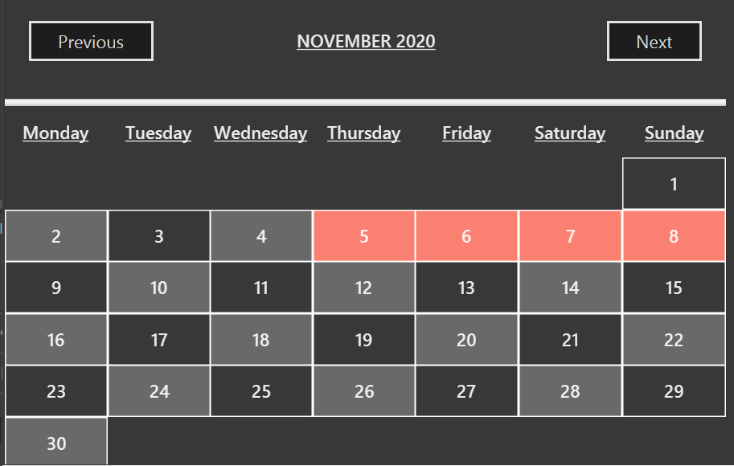
#### Implementation  
The Calendar is added to help reflect the Eventlist in the model. It generates an accurate monthly Calendar based on the current date
and time of the user. This Calendar feature has 2 main parts, the FXML design and the GUI-component class, `Calendar`.

The design of the Calender mainly consists of 2 Gridpanes, one for the header and the other is used to form the days in each month. The header Gridpane
is a 1 x 1 grid, that contains a Label for the month and year, and two buttons for the users to cycle between the months in the Calender.
The second Gridpane is a 7 x 7 grid. The first row is reserved for headers for the different days of the week, while the rest are used
for filling up the days based on the month and year.

The logic of the Calender is located in the `Calendar` under the Ui component. It contains methods to load the month based on the date of the header, a method to scan
through the eventlist in model to identify the days of the events in the eventlist, and the methods for the buttons to switch between the next month and previous month.
The constructor of the Calendar takes in the `ReadOnlyEventList` from model, so that it can check for the dates that need to be marked out. The constructor also
loads in the values for `headerMonth`, `headerYear` and `now`. The `headerMonth` and `headerYear` is used to track which month and year to display in the Calendar, while the `now` tracks the
current month and year to start the Calendar in each time it loads up.

Each time the user presses any of the two buttons, depending on which, the method for handling the buttons will either add or minus a month from the `headerMonth`. This updates the
Calendar on which month to display. Also, the method will check if the current is either the start or end on the year, so that it knows when to change the values of the year.

Next, the method that loads the Calendar will pull the values of `headerMonth` and `headerYear`. It will check if the month is Feburary, and if so, it will check if the
year is a leap year. Then, it will return the appropriate number of days for the `headerMonth`. Then, it checks what is the day of the week that the first day of
this month is on, then it starts to fill up the grid starting from the first day of the week. A VBox is created for each grid cell, and a Label is created and added
to that VBox with the correct value of the dates. If there is an event that falls on the date, it the colour of the VBox will be set to a different color
to indicate an existing event.
  
##General Features

### Undo/redo feature

#### Implementation
The undo/redo mechanism is facilitated by the respective versioned lists of each list type. For example
`VersionedModuleList` for a `ModuleList` type. We will use `VersionedModuleList` to demonstrate the implementation of undo/redo mechanism. It extends `ModuleList` with an undo/redo history, stored internally as an `moduleListStateList` and `currentStatePointer`. Additionally, it implements the following operations:

* `VersionedModuleList#commit()` — Saves the current `ModuleList` state in its history.
* `VersionedModuleList#undo()` — Restores the previous `ModuleList` state from its history.
* `VersionedModuleList#redo()` — Restores a previously undone `ModuleList` state from its history.

These operations are exposed in the `Model` interface as `Model#commitModuleList()`, `Model#undoModuleList()` and `Model#ModuleList()` respectively.

Given below is an example usage scenario and how the undo/redo mechanism behaves at each step.

Step 1. The user launches the application for the first time. The `VersionedModuleList` will be initialized with the initial `ModuleList` state, and the `currentStatePointer` pointing to that single `ModuleList` state.

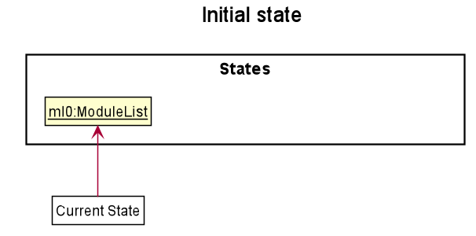

Step 2. The user executes `deletemodule 5` command to delete the 5th module in the `ModuleList`. The `deletemodule` command calls `Model#commitModuleList()`, causing the modified state of the `ModuleList` after the `deletemodule 5` command executes to be saved in the `moduleListStateList`, and the `currentStatePointer` is shifted to the newly inserted `ModuleList` state.

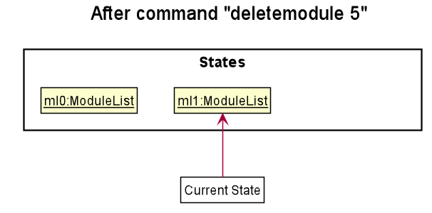

Step 3. The user executes `addmodule n/CS2103T​` to add a new module. The `addmodule` command also calls `Model#commitModuleList()`, causing another modified `ModuleList` state to be saved into the `moduleListStateList`.

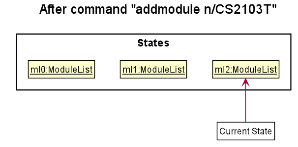

:information_source: **Note:** If a command fails its execution, it will not call `Model#commitModuleList()`, so the `ModuleList` state will not be saved into the `moduleListStateList`.

Step 4. The user now decides that adding the module was a mistake, and decides to undo that action by executing the `undo` command. The `undo` command will call `Model#undoModuleList()`, which will shift the `currentStatePointer` once to the left, pointing it to the previous `ModuleList` state, and restores the `ModuleList` to that state.

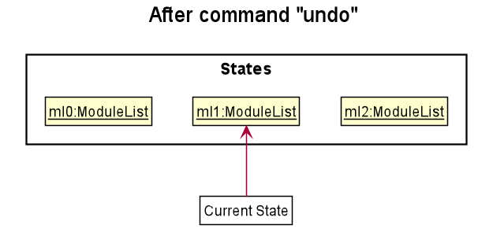

:information_source: **Note:** If the `currentStatePointer` is at index 0, pointing to the initial `ModuleList` state, then there are no previous `ModuleList` states to restore. The `undo` command uses `isIndexZero()` to check if this is the case. If so, it will return an error to the user rather
than attempting to perform the undo.

The following sequence diagram shows how the undo operation works:

:information_source: **Note:** The lifeline for `UndoCommand` should end at the destroy marker (X) but due to a limitation of PlantUML, the lifeline reaches the end of diagram.

The `redo` command does the opposite — it calls `Model#redoModuleList()`, which shifts the `currentStatePointer` once to the right, pointing to the previously committed state, and restores the `ModuleList` to that state.

:information_source: **Note:** If the `currentStatePointer` is at index `moduleListStateList.size() - 1`, pointing to the latest `ModuleList` state, then there are no undone `ModuleList` states to restore. The `redo` command uses `Model#canRedoAddressBook()` to check if this is the case. If so, it will return an error to the user rather than attempting to perform the redo.

Step 5. The user then decides to execute the command `list`. Commands that do not modify `ModuleList`, such as `list`, will usually not call `Model#commitModuleList()`, `Model#undoModuleList()` or `Model#redoModuleList()`. Thus, the `ModuleListStateList` remains unchanged.

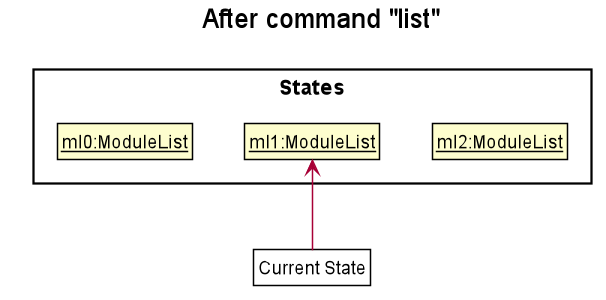

Step 6. The user executes `clearmodule`, which calls `Model#commitModuleList()`. Since the `currentStatePointer` is not pointing at the end of the `moduleListStateList`, all `ModuleList` states after the `currentStatePointer` will be purged. Reason: It no longer makes sense to redo the `addmodule n/CS2103​` command. This is the behavior that most modern desktop applications follow.

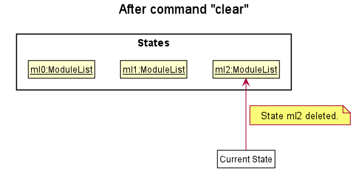

The following activity diagram summarizes what happens when a user executes a new command:

#### Design consideration:

##### Aspect: How undo & redo executes

* **Alternative 1 (current choice):** Saves the entire `moduleList`.
  * Pros: Easy to implement.
  * Cons: May have performance issues in terms of memory usage.

* **Alternative 2:** Individual command knows how to undo/redo by
  itself.
  * Pros: Will use less memory (e.g. for `deletemodule`, just save the module being deleted).
  * Cons: We must ensure that the implementation of each individual command is correct.
--------------------------------------------------------------------------------------------------------------------

## **Documentation, logging, testing, configuration, dev-ops**

* [Documentation guide](Documentation.md)
* [Testing guide](Testing.md)
* [Logging guide](Logging.md)
* [Configuration guide](Configuration.md)
* [DevOps guide](DevOps.md)

--------------------------------------------------------------------------------------------------------------------

## **Appendix: Requirements**

### Product scope

**Target user profile**:

* has a need to manage a number of classes
* prefer desktop apps over other types
* can type fast
* prefers typing to mouse interactions
* is reasonably comfortable using CLI apps

**Value proposition**:
* Users can keep track of all module details efficiently.
* Centralize key module details.
* Keep track of study progress effectively.
* Everything can be done in a single app.

### User stories

Priorities: High (must have) - `* * *`, Medium (nice to have) - `* *`, Low (unlikely to have) - `*`

| Priority | As a …​                                    | I want to …​                     | So that I can…​                                                        |
| -------- | ------------------------------------------ | ------------------------------ | ------------------------------------------------------ |
|                 | module list | |
| `* * *`  | new user                                   | see usage instructions         | refer to instructions when I forget how to use the App |
| `* * *`  | user                                       | add a new module               | keep track of the module information easily            |
| `* * *`  | user                                       | delete a module                | remove modules that are completed                      |
| `* *`    | user                                       | find a module by name          | locate details of a module without having to go through the entire list |
| `* *`    | user                                       | add a zoom link to a module    | keep track and retrieve it easily                      |
| `* *`    | user                                       | calculate my CAP details   | plan my academic progress for the future      |
| `* *`    | user                                       | archive a modules   | hide less relevant modules that might still be useful for future purposes|
| `* *`    | user                                       | add graded assignments       | add the information of the assignments that contributed to my grade      |
|          | contact list                               |                                | |
| `* *`    | user                                       | edit my graded assignments     | update the information of the assignments I have completed     |
| `* *`    | user                                       | delete graded assignments      | remove the assignments that are do not contribute to my grade anymore|
| `*`      | user who is overloading                    | sort modules by name           | locate a module easily                                 |
| `* * *`  | user                                       | add a task                     | keep track of the tasks that I must complete           |
| `* * *`  | user                                       | delete a task                  | remove a task that has been done                       |
| `* * *`  | user                                       | edit a task                    | make necessary changes to a task                       |
| `* *`    | user                                       | label a task as completed      |                                                        |
| `* *`    | user                                       | find a task                    | find a task easily without looking at the entire list  |
| `* *`    | user                                       | sort tasks based on criteria   | easily manage the tasks by order                       |
| `* *`    | user                                       | filter tasks based on criteria | easily manage the tasks by group                       |
| `*`      | user                                       | reset the status of a task     | change a task from labeled as completed to not completed |
| `*`      | user                                       | archive a task                 | hide irrelevant tasks that might still be useful for future purposes |
| `*`      | user                                       | quickly add a module tagged as completed                 | input data to calculate CAP details quickly |
| | todo list | |
| | event list | |

*{More to be added}*

### Use cases

(For all use cases below, the **System** is the `CAP5BUDDY` and the **Actor** is the `user`, unless specified otherwise)

=======
## Module list use cases

**Use case: UC04 - View a module**

**MSS**

1. User requests to view the list of modules.
2. CAP5BUDDY displays all the modules in a list.
3. User requests to view the information of a specific module from the list.
4. CAP5BUDDY displays all information related to the specified module.

**Extensions**

* 2a. The list is empty.

  Use case ends here.

* 3a. The given index is invalid or null.

  * 3a1. CAP5BUDDY displays an error message.

  Use case resumes at step 2.

**Use case: UC05 - Archive a module**

**MSS**

1. User <ins>requests to show all the un-archived modules (UC09).</ins>
2. User wants to archive a specific module from the list.
3. CAP5BUDDY archives the module.

**Extensions**
* 1a. The list is empty.

  Use case ends here.

* 2a. The given index is invalid or does not exist.

  * 2a1. CAP5BUDDY displays an error message.

    Use case resumes at step 2.
    
**Use case: UC06 - Un-archive a module**

**MSS**

1. User <ins>requests to show all the archived modules (UC10).</ins>
2. User wants to un-archive a specific module from the list.
3. CAP5BUDDY un-archives the module.

**Extensions**
* 1a. The list is empty.

  Use case ends here.

* 2a. The given index is invalid or does not exist.

  * 2a1. CAP5BUDDY displays an error message.

    Use case resumes at step 2.

**Use case: UC07 - Calculate CAP**

**MSS**

1. User requests to calculate CAP
2. CAP5BUDDY calculates and displays CAP to user.

Use case ends.

**Extensions**

* 2a. There are no modules tagged as completed.

  * 2a1. CAP5BUDDY displays an error message.

  * 2a2. User enters required data.

  Steps 2a1-2a2 are repeated until the data requirements are fulfilled. 
  Use case resumes at step 2.

**Use case: UC08 - Calculate target CAP details**

**MSS**

1. User requests to calculate target CAP details
2. CAP5BUDDY calculates and displays target CAP details to user.

Use case ends.

**Extensions**

* 2a. There are no modules marked as completed.

  * 2a1. CAP5BUDDY displays an error message.

  * 2a2. User enters required data.

  Steps 2a1-2a2 are repeated until the data requirements are fulfilled. 
  Use case resumes at step 2.

* 2b. User inputs invalid target cap value.
 
   * 2b1. CAP5BUDDY displays an error message.
 
   * 3b2. User enters valid input.
 
   Steps 2a1-2a2 are repeated until the data requirements are fulfilled. 
   Use case resumes at step 2.
   
* 2c. Target cap is unachievable.
 
   * 2c1. CAP5BUDDY displays an error message.
 
   * 4c2. User enters valid input.
 
   Steps 3a1-3a2 are repeated until the data requirements are fulfilled. 
   Use case resumes at step 2. 
   
**Use case: UC09 - View un-archived module list**

**MSS**

1. User requests to view the list of un-archived modules.
2. CAP5BUDDY displays all the un-archived modules.

Use case ends.

**Use case: UC10 - View archived module list**

**MSS**

1. User requests to view the list of un-archived modules.
2. CAP5BUDDY displays all the un-archived modules.

Use case ends.

## Contact list use cases

## Todo list use cases

## General feature use cases

**Use case: Undo previous command**

  **MSS**
  1. User requests to undo previous command.
  2. CAP5BUDDY undoes the previous command.
  
  Use case ends.

  **Extensions**

  * 2a. There are no commands to undo.

    * CAP5BUDDY shows an error message.

      Use case resumes at step 1.
      
**Use case: Redo undone command**

  **MSS**
  1. User requests to redo most recent undone command.
  2. CAP5BUDDY redoes the undone command.
  
  Use case ends.

  **Extensions**

  * 2a. There are no commands to redo.

    * CAP5BUDDY shows an error message.

      Use case resumes at step 1.
      
**Use case: UC01 Add a new Module**

**MSS**

1. User wants to add a new module to track.
2. User enters the command for adding a module: `add [module name/code]`
3. CAP5BUDDY adds the module into storage and display the success message.

*{More to be added}*

**Use case: UC02 - Delete a module**

**MSS**

1. User requests to show all the existing modules.
2. CAP5BUDDY displays a list of the modules.
3. User wants to delete a specific module from the list.
4. User enters the command for module deletion: `delete [module name/code]`
4. CAP5BUDDY deletes that module from the list.

**Extensions**
* 2a. The list is empty.

  Use case ends here.

* 3a. The given index is invalid or does not exist.

  * 3a1. CAP5BUDDY displays an error message.

    Use case resumes at step 2.

*{More to be added}*

**Use case: UC03 - Edit a module**

**MSS**

1. User requests to show all the existing modules.
2. CAP5BUDDY displays all the modules in a list.
3. User wants to edit a specific module from the list.
4. User enters the new information for that module.
5. CAP5BUDDY overwrites the existing information of that module.

**Extensions**
* 2a. The list is empty.

  Use case ends here.

* 3a. The given index is invalid or does not exist.

  * 3a1. CAP5BUDDY displays an error message.

    Use case resumes at step 2.

* 4a. The new information is empty

  * 4a1. CAP5BUDDY display an error message.

  Use case resumes at step 2.

  *{More to be added}*

**Use case: Add a task to todo list**

**MSS**

1. User wants to add a task to the todo list.
2. User chooses the type of task to be added.
3. User enters the information regarding the task.
4. CAP5BUDDY saves the given task in the todo list.

Use case ends.

**Extensions**

* 3a. Format for information about the task is invalid.

  * 3a1. CAP5BUDDY displays an error message and ask the user to use the correct format.
  * 3a2. User enters the information with the correct format.

  Use case resumes at step 4

  *{More to be added}*

**Use case: Delete a task in the todo list**

**MSS**

1. User wants to delete a task in the todo list.
2. User chooses the task to be deleted.
3. CAP5BUDDY shows a prompt message asking if the user really wants to delete the task.
4. User clicks the "YES" button.
5. CAP5BUDDY deletes the task from the todo list.

Use case ends.

**Extensions**

* 4a. User accidentally clicked the "NO" button.

  * 4a1. The prompt message disappears and CAP5BUDDY does not delete the task.

  Use case ends.

  *{More to be added}*

**Use case: Sort task in the todo list**

**MSS**

1. User wants to sort the tasks in the todo list.
2. User chooses the basis for sorting the tasks.
3. CAP5BUDDY displays the sorted tasks based on the chosen basis.

Use case ends.

  *{More to be added}*

**Use case: Find a task in the todo list**

**MSS**

1. User wants to find a task in the todo list.
2. User chooses whether to find task based on date or keyword.
3. User enters the date or keyword.
4. CAP5BUDDY displays all task based on the user input from step 3.

Use case ends.

**Extensions**

* 3a. User inputs the date with an incorrect format.

  * 3a1. CAP5BUDDY displays an error message and ask the user to use the correct format.
  * 3a2. User enters the date with the correct format.

  Use case resumes at step 4

  *{More to be added}*

**Use case: Archive a task in the todo list**

**MSS**

1. User wants to archive a task in the todo list.
2. CAP5BUDDY shows a prompt message asking if the user is sure to archive the task.
3. User clicks the "YES" button.
4. CAP5BUDDY archives the task.

Use case ends.

**Extensions**

* 3a. User accidentally clicked the "NO" button.

  * 3a1. The prompt message disappears and CAP5BUDDY does not archive the task.

  Use case ends.

  *{More to be added}*

**Use Case: View all contact details of a lecturer**

  **MSS**
   1. User requests to view all contact details of a lecturer.
   2. User provides the name of the lecturer.
   3. CAP5BUDDY searches for the specified lecturer from storage.
   4. CAP5BUDDY retrieves all contact details of the lecturer from storage.
   5. CAP5BUDDY displays the desired contact details.

  **Extensions**

   * 3a. The specified lecturer name does not exist.

     * CAP5BUDDY displays an error message.

     Use case ends.

  **Use Case: View the email of a Lecturer**

  **MSS**
  1. User requests to view the email of a lecturer.
  2. User provides the name of the lecturer.
  3. CAP5BUDDY searches for the specified lecturer from storage.
  4. CAP5BUDDY retrieves the email of the lecturer from storage.
  4. CAP5BUDDY displays the desired email address.

  **Extensions**

  * 3a. The specified lecturer name does not exist.

    * CAP5BUDDY displays an error message.

    Use case ends.

  **Use Case: View the hand phone contact of a peer**

  **MSS**
  1. User requests to view the hand phone number of a peer.
  2. User provides the name of the peer.
  3. CAP5BUDDY searches for the specified peer from storage.
  4. CAP5BUDDY retrieves the hand phone contact of the peer from storage.
  4. CAP5BUDDY displays the desired hand phone contact.

  **Extensions**

* 3a. The specified peer name does not exist.

  * CAP5BUDDY displays an error message.

  Use case ends.

* 4a. The specified peer does not have a hand phone contact saved.

  * CAP5BUDDY displays an error message.

  Use case ends.

**Use Case: Edit the email of a TA**

  **MSS**
  1. User requests to edit the email of a TA.
  2. User provides the name of the TA.
  3. CAP5BUDDY searches for the specified TA from storage.
  4. User provides the new email to replace the existing email.
  5. CAP5BUDDY replaces the email of the TA with the user provided email.
  6. CAP5BUDDY displays the success message.

  **Extensions**

  * 3a. The specified TA name does not exist.

    * CAP5BUDDY displays an error message.

    Use case ends.

  * 4a. The provided email address is empty or null.

    * CAP5BUDDY displays an error message.

    Use case ends.

    *{More to be added}*

**Use Case: Add assignment to CAP5BUDDY**

  **MSS**
   1. User requests to add an assignment to a module in CAP5BUDDY.
   2. CAP5BUDDY retrieves module from module list.
   3. CAP5BUDDY creates and adds assignment to the gradetracker in the module retrieved.
   4. CAP5BUDDY updates module in module list.
   5. CAP5BUDDY displays success message.

  **Extensions**

 * 2a. The module to add to is invalid.

    * CAP5BUDDY displays an error message.

      Use case ends.

 * 3a. The given grade is invalid.

    * CAP5BUDDY displays an error message.

      Use case ends.

**Use Case: View grades for a module**

  **MSS**
  1. User requests to view grades for a module.
  2. CAP5BUDDY retrieves current grades.
  3. CAP5BUDDY displays current grades.

  **Extensions**

  * 3a. The current list of grades is empty.

    * CAP5BUDDY displays an error message.

      Use case ends.

**Use Case: Edit assignment in CAP5BUDDY**

  **MSS**
  1. User requests to edit an assignment in a module in CAP5BUDDY.
  2. CAP5BUDDY retrieves the module.
  3. CAP5BUDDY retrieves the assignment requested from the grade tracker in the module.
  4. User requests to edit the assignment retrieved.
  5. CAP5BUDDY edits the assignment.
  6. CAP5BUDDY saves the edited assignment in the module.
  7. CAP5BUDDY displays success message.

  **Extensions**

  * 2a. The given module is invalid.

    * CAP5BUDDY displays an error message.

      Use case ends.

  * 3a. The given assignment is invalid.

    * CAP5BUDDY displays an error message.

      Use case ends.

  *{More to be added}*

**Use case: Delete an assignment**

   **MSS**
   1. User requests to delete an assignment in a module in CAP5BUDDY.
   2. CAP5BUDDY retrieves the module.
   3. CAP5BUDDY retrieves the assignment requested from the grade tracker in the module.
   4. CAP5BUDDY deletes the assignment.
   5. CAP5BUDDY updates the grade tracker in the module.
   4. CAP5BUDDY displays success message.

   **Extensions**

   * 3a. The provided assignment is invalid.

      * CAP5BUDDY displays an error message.

        Use case ends.

   *{More to be added}*

**Use case: Add an event**

  **MSS**
  1. User request to create and add a new event into the tracker.
  2. CAP5BUDDY creates and add the event into the list.

  **Extensions**
  * 1a. The provide event information is invalid, missing date and time.

       * CAP5BUDDY displays an error message.

          Use case resumes at step 1.

**Use case: Edit an event**

  **MSS**
  1. User requests to view all existing events.
  2. CAP5BUDDY displays the list of all events.
  3. User requests to modify an existing event.
  4. CAP5BUDDY displays the newly modified event.

  **Extensions**
  * 3a. The newly inputted information is invalid format or empty.

    * CAP5BUDDY displays an error message.

      Use case resumes at step 2.

  * 3b. The requested event does not exist.

    * CAP5BUDDY displays an error message.

      Use case resumes at step 2.

**Use case: Delete an event**

  **MSS**
  1. User requests to view all existing events in the list.
  2. CAP5BUDDY displays all the events.
  3. User requests to remove a specific event from the list.
  4. CAP5BUDDY shows a success message and shows the new list.

  **Extensions**
  * 3a. The event to be removed does not exist.

    * CAP5BUDDY displays an error message.

      Use case resumes at step 2.

**Use case: Mark an event as completed**

  **MSS**
  1. User requests to show all events.
  2. CAP5BUDDY displays all tracked events.
  3. User requests to mark a specific event as completed.
  4. CAP5BUDDY shows the event as completed.

  **Extensions**

  * 3a. The event requested does not exist.

    * CAP5BUDDY shows an error message.

      Use case resumes at step 2.

  * 3b. The event requested is already marked as completed/

    * CAP5BUDDY does nothing.

      Use case resumes at step 2.

**Use case: Push the event back**

  **MSS**
  1. User requests to show all events.
  2. CAP5BUDDY displays all currently tracked events.
  3. User requests to push the event back.
  4. CAP5BUDDY shows the new date and time of the event.

  **Extensions**

  * 3a. The requested event does not exist.

    * CAP5BUDDY shows an error message.

      Use case resumes at step 2.

  * 3b. The new date and time is invalid.

    * CAP5BUDDY shows an error message.

      Use case resumes at step 2.
      
### Non-Functional Requirements

1.  Should work on any _mainstream OS_ as long as it has Java `11` or above installed.
2.  A user with above average typing speed for regular English text (i.e. not code, not system admin commands) should be able to accomplish most of the tasks faster using commands than using the mouse.
3.  A user with not be able to access and modify other users' data files.
4.  Should be usable by any novice that has never used this program before.
5.  The name of the modules should not exceed 40 characters.
6.  Should not contain more than 100 modules at 1 time.

*{More to be added}*

### Glossary

* **Mainstream OS**: Windows, Linux, Unix, OS-X
* **Module List**: A list of all modules currently being tracked and stored in the CAP5BUDDY.
* **CAP**: Calculate Cumulative Average Point, a grading number that rates academic level in NUS.

--------------------------------------------------------------------------------------------------------------------

## **Appendix: Instructions for manual testing**

Given below are instructions to test the app manually.

:information_source: **Note:** These instructions only provide a starting point for testers to work on;
testers are expected to do more *exploratory* testing.

### Launch and shutdown

1. Initial launch

   1. Download the jar file and copy into an empty folder

   1. Double-click the jar file Expected: Shows the GUI with a set of sample contacts. The window size may not be optimum.

1. Saving window preferences

   1. Resize the window to an optimum size. Move the window to a different location. Close the window.

   1. Re-launch the app by double-clicking the jar file. 
       Expected: The most recent window size and location is retained.

1. _{ more test cases …​ }_

### Module List

#### Deleting a module

1. Deleting a module while all modules are being shown

   1. Prerequisites: List all un-archived modules using the `listmodule` command. Multiple modules in the list.

   1. Test case: `deletemodule 1` 
      Expected: First module is deleted from the list. Details of the deleted module shown in the status message.

   1. Test case: `deletemodule 0` 
      Expected: No module is deleted. Error details shown in the status message.

   1. Other incorrect delete module commands to try: `deletemodule`, `deletemodule x`, `...` (where x is larger than the module list size) 
      Expected: Similar to previous.
      
#### Archiving a module
 
 1. Archiving a module while all modules are being shown
 
    1. Prerequisites: List all modules using the `listmodule` command. Multiple modules in the list.
 
    1. Test case: `archivemodule 1` 
       Expected: First module is archived. Details of the deleted module shown in the status message.
 
    1. Test case: `archivemodule 0` 
       Expected: No module is archived. Error details shown in the status message.
 
    1. Other incorrect archive module commands to try: `archivemodule`, `archivemodule x`, `...` (where x is larger than the module list size) 
       Expected: Similar to previous.
       
 * Similar test procedures can be used to test the un-archive module feature. This can be done by using the keyword `unarchivemodule`
   instead of `archivemodule`.
   
   * Prerequisites : List all archived modules using the `viewarchive` command. Multiple modules in the list.
   
#### Finding a module
 
1. Finding a module while all modules are being shown.

   1. Prerequisites: List out all modules using the `listmodule` command. Multiple modules in the list.

   1. Test case: `findmodule CS2030`  
      Expected: Any module with their name containing the word `CS2030` will be displayed in the contact list panel.
     
   1. Test case: `findmodule CS2030 CS2040`  
     Expected: Any module with their name containing the word `CS2030`  or `CS2040` will be displayed in the contact list panel.

   1. Test case: `findmodule`  
      Expected: No module is found.
      
#### Clearing modules

1. Clearing module list while all modules are being shown.

   1. Prerequisites: List out all modules using the `listmodule` command. Multiple modules in the list.

   1. Test case: `clearmodule`  
      Expected: All modules cleared, module list should be empty.

2. Clearing module list while some modules are being shown.

   1. Prerequisites: List out some modules using the `findmodule` command. A few modules in the list.

   1. Test case: `clearmodule`  
      Expected: All modules cleared, module list should be empty.

#### Calculate CAP
 
 1. Calculate CAP
 
    1. Prerequisites: There must be at least one module tagged as completed and containing grade point information.
 
    1. Test case: `calculatecap` 
       Expected: CAP is calculated. Details of the calculated CAP shown in the status message.
       
#### Calculate target CAP details

1. Target Cap

   1. Prerequisites: There must be at least one module tagged as completed and containing grade point information.

   1. Test case: `targetcap 5` 
      Expected: Target CAP details are calculated. Target CAP details shown in the status message.    
   
### Contact List

### Todo List

### Event List

### Common Features

#### Undo a command
 
 1. There is an undoable command
 
    1. Prerequisites: A command that modifies the storage has been entered is since the application started.
 
    1. Test case: `undo` 
       Expected: Most recent undoable command is undone. Undo command success message shown in the status message.
 
 2. There is no undoable command      
 
    1. Prerequisites: The application is freshly started with no commands entered yet.
     
    1. Test case: `undo` 
       Expected: No command is undone. Error details shown in the status message.
         
#### Redo a command
 
 1. There is a redoable command
 
    1. Prerequisites: A command has been redone. Commands that modify the storage have not been entered since. (e.g deletemodule)
 
    1. Test case: `redo` 
       Expected: Most recent undoable command is undone. Redo command success message shown in the status message.
 
 2. There is no redoable command      
 
    1. Prerequisites: The application is freshly started with no commands entered yet.
     
    1. Test case: `redo` 
       Expected: No command is redone. Error details shown in the status message.

### Saving data

1. Dealing with missing/corrupted data files

   1. _{explain how to simulate a missing/corrupted file, and the expected behavior}_

1. _{ more test cases …​ }_
