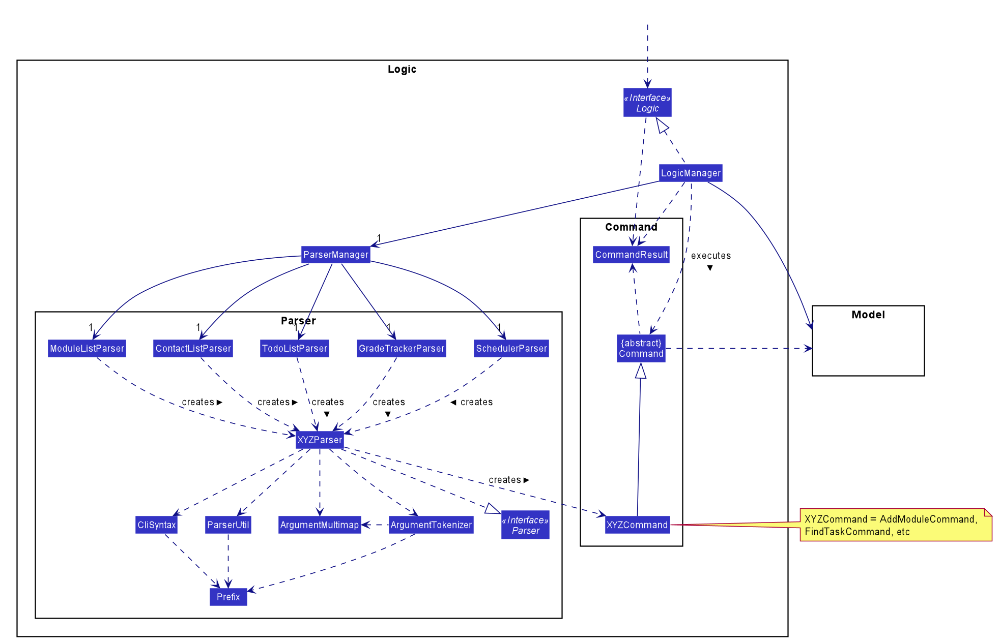
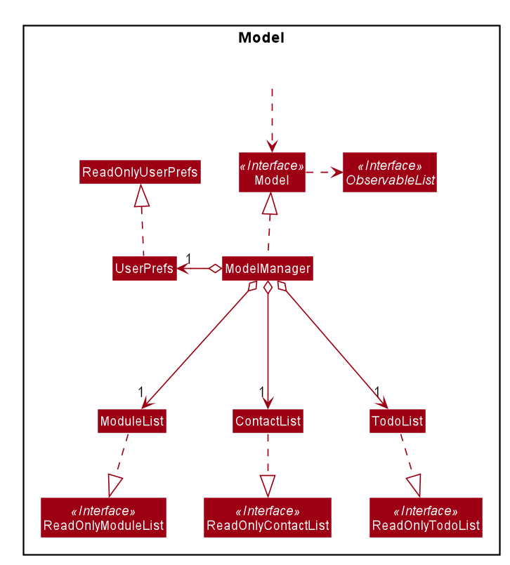
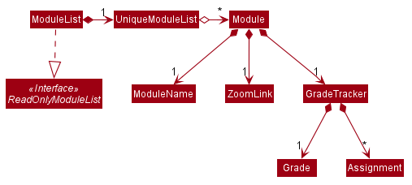
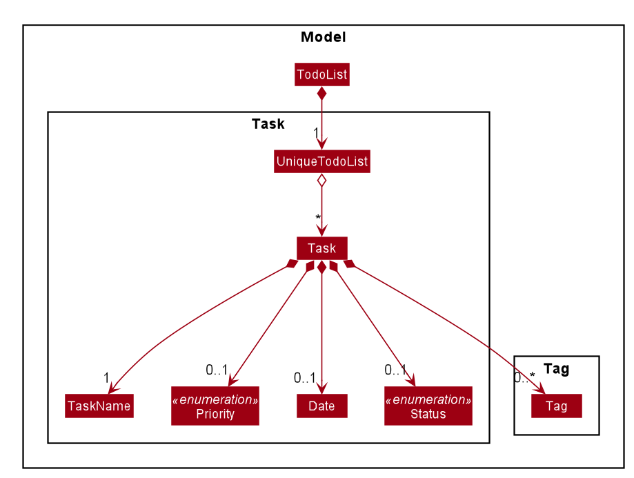
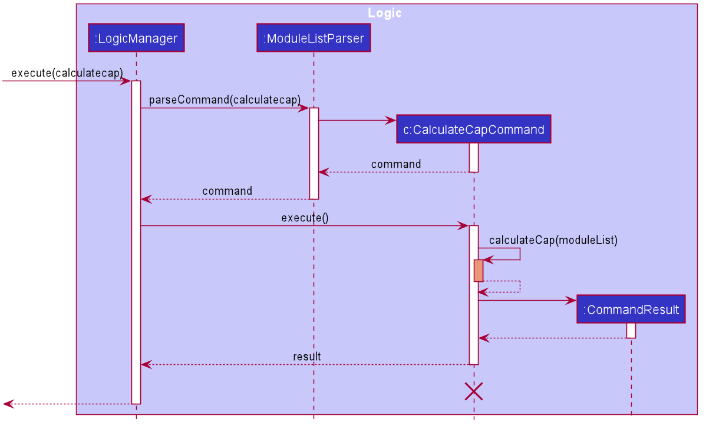
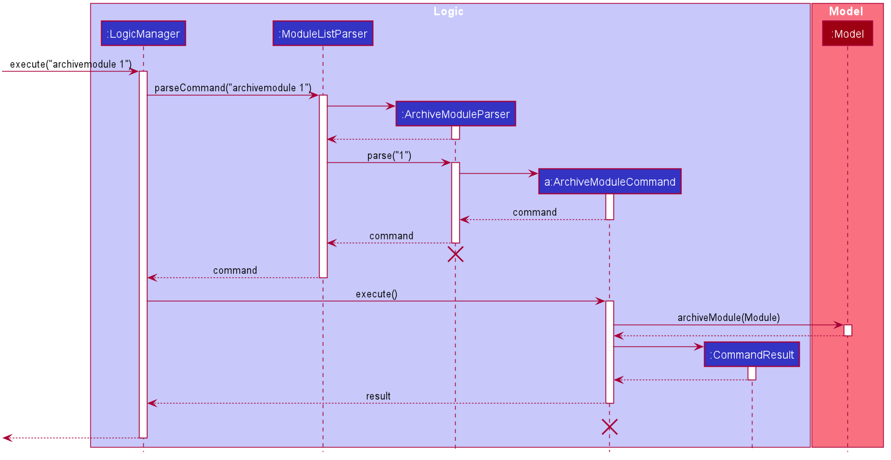
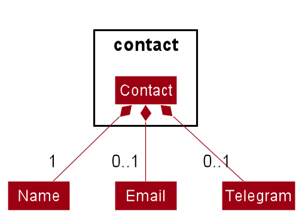
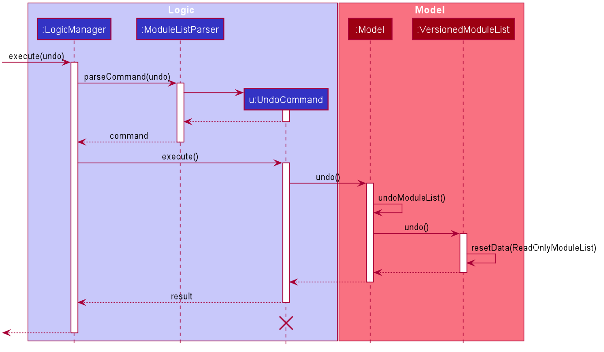
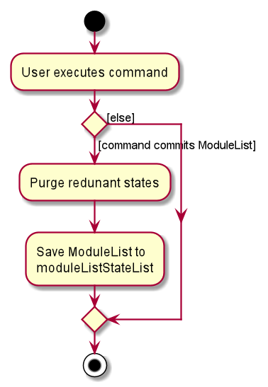

* Table of Contents
{:toc}

--------------------------------------------------------------------------------------------------------------------
## **Introduction**

CAP5Buddy helps NUS SoC students to keep track of their module details efficiently. It helps them centralize key
module details and follows their study progress through a Command Line Interface (CLI) that allows efficient management
of module details. CAP5Buddy also functions as a scheduling system, todo list and contact list.

## **Setting up, getting started**

Refer to the guide [_Setting up and getting started_](SettingUp.md).

--------------------------------------------------------------------------------------------------------------------

## **Design**

### Architecture

**How the architecture components interact with each other**

### Overall components

This is the overall design of our product. As we are using **GUI to help to display the information** and mainly focuses on
using **CLI to take in the required commands**, thus the product consists of **6 main major components**. The product starts
from the Launcher classes, that initiates based on our pre-set settings and then activates the MainApp class
the will run the GUI with these settings. MainApp will also start the _brain_ and -muscles_ of the program, which are the Logic, Storage,
Model and Ui components.

The role of the **Logic** component is to act as the _brain_ of the program, where all the parsing of information will be done, and the
execution of the commands will be carried out.

The role of the **Storage** component is to represent the _memory_ of the program, where the storing and tracking of the different items happens.
These items are saving locally in a json file, which can be imported and exported easily.

The role of the **Model** component is to represent all the items and their behaviours. Contains all the item classes and their support classes.

The role of the **Ui** component is to handle all the User interface related instructions, which includes the loading of GUI components, the updating
of these components and displaying the changes.

## Module Tracker

### UI component

The job of the UI component is to be the _face_ of the product, which the user directly interacts with.
It is in charge of containing the logic that **breaks down and executes the user input**, and displaying the **GUI** of the
product.

It composes of a few main classes, that serves as the focal point of this component. Such classes are **UiPart**,
**MainWindow**, **UiManager** and the respective panel displays, **(XYZListPanel)**. The rest of the classes are supporting
classes to help make the GUI.

The MainWindow is what the user actually sees, which has a **CommandBox**, **XYZListPanel**, **ResultDisplay** and **StatusBar**. These
components are stacking on top of one another using **stackPane** to ensure a smooth looking GUI. The order of the components
are as follows, **CommandBox**, **ResultDisplay**, **XYZListPanel** and **StatusBar**.

The **CommandBox** is just a textField component where the user can enter the commands. Upon pressing *Enter*, extracting of the
text occurs and is sent to the logic to be parsed and executed.

Next, after the executing is completed, a **CommandResult** object returns and is then passed to the **ResultDisplay** for the
relevant information to be shown in this component. This is being displayed in a TextArea component.

Lastly, the **XYZListPanel** is in charge of displaying all the modules, contacts, etc that is the product is tracking.
Each of these items are being displayed in a *cell* under their respective **XYZCard**, which will be displayed in the *ListCell*
of the **XYZListPanel**.

**API** :

### Logic component

**API** : `Logic.java`

1. Logic uses the `ParserManager` class to create the respective Parser classes: `ModuleListParser`, `ContactListParser`
 and `TodoListParser`. Depending on the user command, the user command will be parsed by the relevant Parser class.
2. This results in a `Command` object which is executed by `LogicManager`.
3. The command execution can affect the Model (e.g. adding a module).
4. The result of the command execution is encapsulated as a `CommandResult` object which is passed back to the `Ui`.
5. In addition, the `CommandResult` object can also instruct the `Ui` to perform certain actions, such as displaying
help to the user.

### Model component

**API** : [`Model.java`](https://github.com/AY2021S1-CS2103T-F12-3/tp/blob/master/src/main/java/seedu/address/model/Model.java)

The `Model`,

* stores a `UserPref` object that represents the user’s preferences.
* stores the data for these 3 types of list:
  * module tracker
  * contact list
  * todo list
* exposes an unmodifiable `ObservableList<T>` for all types of list as mentioned above which can be 'observed' e.g. the UI can be bound to this list so that the UI automatically updates when the data in the list change.
* does not depend on any of the other three components

### Storage component

**API** : [`Storage.java`](https://github.com/se-edu/addressbook-level3/tree/master/src/main/java/seedu/address/storage/Storage.java)

The `Storage` component facilitates the storage of CAP5BUDDY data in the hard drive. When the program attempts to save
data, the `Storage` component converts java data objects such as `ModuleList` and `ContactList` into a json format to store
at a specified file location. When the program is started, it will attempt to read existing user data and the `Storage`
component will be converting data in json format into java objects.

* can save `UserPref` objects in json format and read it back.
* can save the module list data in json format and read it back.
* can save the contact list data in json format and read it back.
* can save the todo list data in json format and read it back.

### Common classes

Classes used by multiple components are in the `seedu.addressbook.commons` package.
### Common classes

**API** :

## Module List

**Module package** : [`seedu.address.model.module`](https://github.com/AY2021S1-CS2103T-F12-3/tp/tree/master/src/main/java/seedu/address/model/module)

* Module is a container class that stores :
  * Name of a module
  * Zoom link of a module
  * GradeTracker of a module
* GradeTracker is a container class that stores:
  * Grade for a module
  * Assignments for a module

#### ModuleList class
**ModuleList class** : [`ModuleList.java`](https://github.com/AY2021S1-CS2103T-F12-3/tp/blob/master/src/main/java/seedu/address/model/ModuleList.java)

* Wraps all data i.e. Modules at the module list level
* Stores Modules in memory
* Stores a UniqueModuleList
* Duplicate Modules are not allowed

## CAP Calculator

## Scheduler

## Contact List

#### Contact class

**Contact package** : [`seedu.address.model.contact`](https://github.com/AY2021S1-CS2103T-F12-3/tp/tree/master/src/main/java/seedu/address/model/contact)

* Contact is a container class that stores :
  * Name of a contact
  * Email of a contact
  * Telegram of a contact
#### ContactList class
**ContactList class** : [`ContactList.java`](https://github.com/AY2021S1-CS2103T-F12-3/tp/blob/master/src/main/java/seedu/address/model/ContactList.java)

* Wraps all data i.e. Contacts at the contact list level
* Stores Contacts in memory
* Stores a UniqueContactList
* Duplicate Contacts are not allowed

## Todo List

#### Task class

**Task package** : [`seedu.address.model.task`](https://github.com/AY2021S1-CS2103T-F12-3/tp/tree/master/src/main/java/seedu/address/model/task)

* Task is a container class that stores :
  * Name of a task
  * Tags of a task
  * Priority of a task
  * Date or deadline of a task
  * Status of a task 
  Only name is compulsory when creating a new Task.

#### TodoList class

**TodoList class** : [`TodoList.java`](https://github.com/AY2021S1-CS2103T-F12-3/tp/blob/master/src/main/java/seedu/address/model/TodoList.java)

* Wraps all data i.e. Tasks at the Todo List level
* Stores Tasks in memory
* Stores a UniqueTodoList
* Duplicate Task objects are now allowed

TodoList will be explained more comprehensively in the [TodoList feature](#todolist-feature) Section

--------------------------------------------------------------------------------------------------------------------

## **Implementation**

This section describes some noteworthy details on how certain features are implemented.

### \[Proposed\] Add Event feature

#### Proposed Implementation
The idea of this feature is to be able to allow the user to keep track of his/her current events that
will be happening. Events can be either a one time event like an exam for a particular module, or a recurring
event like a weekly tutorial class.

How we are currently implementing this feature is by following the same implementation as the AB3. We have an event
object under the Model package. Two classes called EventName and EventTime act as information containers to store
the respective data and help support the Event class.

We also make sure in the Logic package, there are personal sub-parsers for each of the existing Event
related commands, and an overall Parser known as SchedulerParser that is in charge of managing all of the
sub-parsers of the Scheduler.

Each of the commands of the Scheduler will always return a CommandResult class, that is basically an information
container that stores all the relevant data of the results. This CommandResult object is then passes back up to the
UiManager, where it is then passed to the GUI components for it to be displayed.

#### Design consideration:

##### Aspect: Whether to create a new Parser for Scheduler.
Option 1 **(Current implementation)**: A custom Parser in charge of all **Scheduler** related commands **only**.
Pros:
- More OOP orientated.
- More defensive programming.
Cons:
- More Parsers to handle by the ParserManager

Option 2: Place the Scheduler related parser together with the rest of the other parsers for other features, like module list, etc.
Pros:
- Faster to implement.
- Less effort needed, simply add on to the existing Parser.
Cons:
- Mess and less readible, hard to distinguish between differnt commands.
- Higher chance of errors, as we are mixing all the different parsers for every feature into a single Parser.
- LONG methods.

## Module Tracker Features

### Calculate CAP 

#### Implementation

The calculate CAP function is facilitated by `CalculateCapCommand`. It extends Command with a counter for total
grade points and modular credits, both stored internally `gradePoints` and `modularCredits` respectively. Additionally, it implements the following operations:

* `CalculateCapCommand#calculateCap()` - Calculates CAP using data from modules tagged as completed in current `ModuleList` and archived `ModuleList`.

The following sequence diagram shows how the calculate cap operation works:

:information_source: **Note:** The lifeline for `CalculateCapCommand`
should end at the destroy marker (X) but due to a limitation of PlantUML, the lifeline reaches the end of diagram.

#### Design consideration:

##### Aspect: Information used to calculate cap
* Alternative 1 (current choice): Calculates based on academic information on mods tagged as completed.
    * Pros : Easy to implement.
    * Cons : User has to manually input every module to be used as data for calculation.

* Alternative 2 : Prompts user for academic information used for last calculated cap and stores it.
    * Pros :
     * User does not need to input unnecessary modules.
     * Will use less memory.(e.g Modules that the user is not currently taking does not need to be added by user).
    * Cons : Will require additional storage.
    
### Calculate target CAP details

#### Implementation

The calculate CAP function is facilitated by `TargetCapCalculatorCommand`. It extends Command. Additionally, it implements the following operations:

* `TargetCapCalculatorCommand#calculateCapNeeded()` - Calculates CAP needed for planned modules for user to achieve input target CAP using data from modules in current `ModuleList` and archived `ModuleList`.

The following sequence diagram shows how the target cap operation works:

:information_source: **Note:** The lifeline for `CalculateCapCommand`
should end at the destroy marker (X) but due to a limitation of PlantUML, the lifeline reaches the end of diagram.

### Module list data archiving

#### Implementation

The module list data archiving function is facilitated by `ModelManager`. It keeps track of a additional `ModuleList` which stores archived modules as
compared the the current `ModuleList` that stores currently relevant modules. Additionally, it implements the following operations:

* `ModelManager#archiveModule()` - Archives a module by removing it from the current `ModuleList` and placing it in the archived `ModuleList`.

* `ModelManager#unarchiveModule()` - Un-archives a module by removing it from the archived `ModuleList` and placing it in the current `ModuleList`.

The following sequence diagram shows how the archive module operation works:

:information_source: **Note:** The lifeline for `ArchiveModuleCommand`
should end at the destroy marker (X) but due to a limitation of PlantUML, the lifeline reaches the end of diagram.

The `unarchivemodule` command does the opposite — it calls `Model#unarchiveModule()`, which removes the specified module  from the archived `ModuleList` and placing it in the current `ModuleList`.

### 1.1 Contact List Management

As a module tracking system, Cap 5 Buddy allows users to manage a list of module-related contacts with ease.

The section below provides details of the implementation of each Contact List function and design considerations
of the contact list feature.

#### 1.1.1 Contact List Commands

Below is a list of all `Contact` related features:

1. Add a contact: Adds a new contact into the contact list
2. Delete a contact: Deletes a pre-existing contact from the contact list
3. Edit a contact: Edits a pre-existing contact in the contact list
4. View all contacts: Lists out all contacts in the contact list

Given below is the class diagram of the `Contact` class:

Figure ?.? Class Diagram for Contact class

#### 1.1.2 Details of implementation

Given below is an example usage scenario and how the mechanism for adding contact behaves at each step:
1. `LogicManager` receives the user input `addcontact n/John e/john@gmail.com te/@johndoe` from `Ui`
2. `LogicManager` calls `ContactListParser#parseCommand()` to create `AddContactParser`
3. `ContactListParser` will call the respective `AddContactParser#parse()` method to parse the command arguments
4. This creates a `AddContactCommand` and `AddContactCommand#execute` will be invoked by `LogicManager`
5. The `Model#addContact()` operation exposed in the `Model` interface is used to add the new contact
6. A `CommandResult` from the command execution is returned to `LogicManager`

Given below is the sequence diagram of how the operation to add a contact works:

Figure ?.? Sequence diagram for the execution of `AddContactCommand`

The section below describes the implementation details of each Contact List feature.

####Add Contact Feature
* This feature creates and adds a new `Contact` using the contact details provided by users
* `ContactListParser` invokes `AddContactParser#parse()` to parse and validate the command arguments
* `AddContactCommand#execute()` will be called to add the new `Contact` if the contact does not already exist
* The mechanism to add a contact is facilitated by `Contactlist` which implements `ContactList#addContact()`
* This operation is exposed in the `Model` interface as `Model#addContact()`

The following activity diagram summarizes what happens when a user executes the `AddContactCommand`:

Figure ?.? Activity diagram representing the execution of `AddContactCommand`

#### Delete Contact Feature
* This feature deletes a pre-existing `Contact` using the contact ID provided by users
* `ContactListParser` invokes `DeleteContactParser#parse()` to parse and validate the contact ID
* `DeleteContactCommand#execute()` will be called to delete the `Contact`
* The mechanism to delete a contact is facilitated by `ContactList` which implements `ContactList#removeContact()`
* This operation is exposed in the `Model` interface as `Model#deleteContact()`

#### Edit Contact Feature
* This feature edits a pre-existing `Contact` using the contact details provided by users.
* `ContactListParser` invokes `EditContactParser#parse()` to parse and validate the contact ID and command arguments
* `EditContactCommand#execute()` will be called to create the edited `Contact` and replace the old contact with the edited contact,
   if the edited contact does not already exist
* The mechanism to edit a contact is facilitated by `ContactList` which implements `ContactList#setContact()`
* This operation is exposed in the `Model` interface as `Model#setContact()`

#### View Contact Feature

#### 1.1.2 Design Considerations  
##### Aspect: Data structure to support Contact related functions
* Alternative 1: Use a `HashMap` to store contacts
  * Pros: Will be more efficient to retrieve contacts from a HashMap.
  * Cons: Requires additional memory to support the HashMap. This would worsen as the number of contacts stored increases.
* Alternative 2: Use an `ArrayList` to store contacts

### TodoList feature

#### Implementation

The TodoList feature has two main component :

* **Containee component** (Task-related classes)
  * `Class Task` - container class to store information about a task
  * `Class TaskName` - wrapper class to store the name of a task
  * `Class Date` - wrapper class to store the date/deadline of a task
  * `Enum Priority` - enum class to represent priority of a task
  * `Enum Status` - enum class to represent the progress status of a task

* **Container component** (List-like classes)
  * Class `UniqueTodoList` - container class for storing tasks
  * Class `TodoList` - wrapper class for UniqueTodoList
  * Interface `ReadOnlyTodoList` - interface for displaying the list on the GUI

##### Containee Component

The Task class mainly functions as a class to store all the informations related to a task i.e. name, tag, priority,
date, and status. It does not have any subclasses.

The Task class supports the following operations :

* Setters for all the field
* Getters for all the field
* `Task#isSameTask()` - checks if two tasks are the same i.e. have the same name
(weaker than Task#equals() which requires all the fields to be the same)
* `Task#hasSameTag()` - checks if the task has the specified tag
* `Task#hasSamePriority()` - checks if the task has the specified priority
* `Task#hasSameDate()` - checks if the task has the specified date

##### Container Component

The TodoList class is facilitated by UniqueTodoList. The UniqueTodoList is stored internally inside
the TodoList class which act like a wrapper class.

The TodoList class supports the following operations :

* `TodoList#resetData()` - replaces all data in TodoList with new data.
* `TodoList#hasTask()` - checks if the specified task exist in the list.
* `TodoList#addTask()` - adds a task to the list.
* `TodoList#setTask()` - replaces a task with the specified task.
* `TodoList#removeTask()` - removes the specified task from the list.

The operations above are exposed in the Model interface as :

* `Model#hasTask()`
* `Model#addTask()`
* `Model#setTask()`
* `Model#deleteTask()`

TodoList implements ReadOnlyTodoList which require the following operation :

* `ReadOnlyTodoList#getTodoList()` - returns an ObservableList with type Task that is immutable, and we cannot
  modify the elements.

#### Design Consideration

##### Aspect: Task type

* Alternative 1 (current):  
  Use one concrete class i.e. Task without inheritance involved. The type of the task
  is represented by the Tag field instead.

  Pros :
  * Easier to implement
  * Types are not pre-defined i.e. can simply add a different tag to represent different type of task

  Cons :
  * All type of task have the same pre-defined field

* Alternative 2 :  
  Use one abstract class i.e. Task with inheritance. Each subclasses represent a type of a Task.

  Pros :
  * Difference between type are clear and standardized
  * Can be considered more OOP

  Cons :
  * Types must be pre-defined i.e. cannot add new type of classes without adding codes

  Alternative 1 is chosen since we prioritize user freedom to create custom type for the task.

### \[Proposed\] GradeTracker feature

#### Proposed Implementation

The proposed grade tracker feature is an association class used to store additional information for the module.
The `Assignments` each store their own `assignment name`, `percentage of final grade` and `result`.

When an `assignment` is added, it follows the sequence diagram as shown below. The sequence flows similarly
to the rest of the project as the command is parsed and then executed.

#### Design consideration:

##### Aspect: Format to store the grade for a module
* Alternative 1 : Grade stores CAP.
    * Pros : Easier to integrate with Cap Calculator
    * Cons : User has to manually input CAP and does not know the average from the assignments accumulated

* Alternative 2 (current choice): Grade stores the raw score calculated from assignment
    * Pros : Grade can be automatically calculated from the assignment overall percentage for user to view
    * Cons : Requires separate CAP to be stored for Cap Calculator to access

### Undo/redo feature

#### Implementation
The undo/redo mechanism is facilitated by the respective versioned lists of each list type. For example
`VersionedModuleList` for a `ModuleList` type. We will use `VersionedModuleList` to demonstrate the implementation of undo/redo mechanism. It extends `ModuleList` with an undo/redo history, stored internally as an `moduleListStateList` and `currentStatePointer`. Additionally, it implements the following operations:

* `VersionedModuleList#commit()` — Saves the current `ModuleList` state in its history.
* `VersionedModuleList#undo()` — Restores the previous `ModuleList` state from its history.
* `VersionedModuleList#redo()` — Restores a previously undone `ModuleList` state from its history.

These operations are exposed in the `Model` interface as `Model#commitModuleList()`, `Model#undoModuleList()` and `Model#ModuleList()` respectively.

Given below is an example usage scenario and how the undo/redo mechanism behaves at each step.

Step 1. The user launches the application for the first time. The `VersionedModuleList` will be initialized with the initial `ModuleList` state, and the `currentStatePointer` pointing to that single `ModuleList` state.

Step 2. The user executes `deletemodule 5` command to delete the 5th module in the `ModuleList`. The `deletemodule` command calls `Model#commitModuleList()`, causing the modified state of the `ModuleList` after the `deletemodule 5` command executes to be saved in the `moduleListStateList`, and the `currentStatePointer` is shifted to the newly inserted `ModuleList` state.

Step 3. The user executes `addmodule n/CS2103T​` to add a new module. The `addmodule` command also calls `Model#commitModuleList()`, causing another modified `ModuleList` state to be saved into the `moduleListStateList`.

:information_source: **Note:** If a command fails its execution, it will not call `Model#commitModuleList()`, so the `ModuleList` state will not be saved into the `moduleListStateList`.

Step 4. The user now decides that adding the module was a mistake, and decides to undo that action by executing the `undo` command. The `undo` command will call `Model#undoModuleList()`, which will shift the `currentStatePointer` once to the left, pointing it to the previous `ModuleList` state, and restores the `ModuleList` to that state.

:information_source: **Note:** If the `currentStatePointer` is at index 0, pointing to the initial `ModuleList` state, then there are no previous `ModuleList` states to restore. The `undo` command uses `isIndexZero()` to check if this is the case. If so, it will return an error to the user rather
than attempting to perform the undo.

The following sequence diagram shows how the undo operation works:

:information_source: **Note:** The lifeline for `UndoCommand` should end at the destroy marker (X) but due to a limitation of PlantUML, the lifeline reaches the end of diagram.

The `redo` command does the opposite — it calls `Model#redoModuleList()`, which shifts the `currentStatePointer` once to the right, pointing to the previously committed state, and restores the `ModuleList` to that state.

:information_source: **Note:** If the `currentStatePointer` is at index `moduleListStateList.size() - 1`, pointing to the latest `ModuleList` state, then there are no undone `ModuleList` states to restore. The `redo` command uses `Model#canRedoAddressBook()` to check if this is the case. If so, it will return an error to the user rather than attempting to perform the redo.

Step 5. The user then decides to execute the command `list`. Commands that do not modify `ModuleList`, such as `list`, will usually not call `Model#commitModuleList()`, `Model#undoModuleList()` or `Model#redoModuleList()`. Thus, the `ModuleListStateList` remains unchanged.

Step 6. The user executes `clearmodule`, which calls `Model#commitModuleList()`. Since the `currentStatePointer` is not pointing at the end of the `moduleListStateList`, all `ModuleList` states after the `currentStatePointer` will be purged. Reason: It no longer makes sense to redo the `addmodule n/CS2103​` command. This is the behavior that most modern desktop applications follow.

The following activity diagram summarizes what happens when a user executes a new command:

#### Design consideration:

##### Aspect: How undo & redo executes

* **Alternative 1 (current choice):** Saves the entire `moduleList`.
  * Pros: Easy to implement.
  * Cons: May have performance issues in terms of memory usage.

* **Alternative 2:** Individual command knows how to undo/redo by
  itself.
  * Pros: Will use less memory (e.g. for `deletemodule`, just save the module being deleted).
  * Cons: We must ensure that the implementation of each individual command is correct.
--------------------------------------------------------------------------------------------------------------------

## **Documentation, logging, testing, configuration, dev-ops**

* [Documentation guide](Documentation.md)
* [Testing guide](Testing.md)
* [Logging guide](Logging.md)
* [Configuration guide](Configuration.md)
* [DevOps guide](DevOps.md)

--------------------------------------------------------------------------------------------------------------------

## **Appendix: Requirements**

### Product scope

**Target user profile**:

* has a need to manage a number of classes
* prefer desktop apps over other types
* can type fast
* prefers typing to mouse interactions
* is reasonably comfortable using CLI apps

**Value proposition**:
* Users can keep track of all module details efficiently.
* Centralize key module details.
* Keep track of study progress effectively.
* Everything can be done in a single app.

### User stories

Priorities: High (must have) - `* * *`, Medium (nice to have) - `* *`, Low (unlikely to have) - `*`

| Priority | As a …​                                    | I want to …​                     | So that I can…​                                                        |
| -------- | ------------------------------------------ | ------------------------------ | ------------------------------------------------------ |
| `* * *`  | new user                                   | see usage instructions         | refer to instructions when I forget how to use the App |
| `* * *`  | user                                       | add a new module               | keep track of the module information easily            |
| `* * *`  | user                                       | delete a module                | remove modules that are completed                      |
| `* *`    | user                                       | find a module by name          | locate details of a module without having to go through the entire list |
| `* *`    | user                                       | add a zoom link to a module    | keep track and retrieve it easily                      |
| `* *`    | user                                       | calculate my CAP details   | plan my academic progress for the future      |
| `* *`    | user                                       | archive a modules   | hide less relevant modules that might still be useful for future purposes|
| `* *`    | user                                       | add graded assignments       | add the information of the assignments that contributed to my grade      |
| `* *`    | user                                       | edit my graded assignments     | update the information of the assignments I have completed     |
| `* *`    | user                                       | delete graded assignments      | remove the assignments that are do not contribute to my grade anymore|
| `*`      | user who is overloading                    | sort modules by name           | locate a module easily                                 |
| `* * *`  | user                                       | add a task                     | keep track of the tasks that I must complete           |
| `* * *`  | user                                       | delete a task                  | remove a task that has been done                       |
| `* * *`  | user                                       | edit a task                    | make necessary changes to a task                       |
| `* *`    | user                                       | label a task as completed      |                                                        |
| `* *`    | user                                       | find a task                    | find a task easily without looking at the entire list  |
| `* *`    | user                                       | sort tasks based on criteria   | easily manage the tasks by order                       |
| `* *`    | user                                       | filter tasks based on criteria | easily manage the tasks by group                       |
| `*`      | user                                       | reset the status of a task     | change a task from labeled as completed to not completed |
| `*`      | user                                       | archive a task                 | hide irrelevant tasks that might still be useful for future purposes |
| `*`      | user                                       | quickly add a module tagged as completed                 | input data to calculate CAP details quickly |
*{More to be added}*

### Use cases

(For all use cases below, the **System** is the `CAP5BUDDY` and the **Actor** is the `user`, unless specified otherwise)

**Use case: UC01 Add a new Module**

**MSS**

1. User wants to add a new module to track.
2. User enters the command for adding a module: `add [module name/code]`
3. CAP5BUDDY adds the module into storage and display the success message.

*{More to be added}*

**Use case: UC02 - Delete a module**

**MSS**

1. User requests to show all the existing modules.
2. CAP5BUDDY displays a list of the modules.
3. User wants to delete a specific module from the list.
4. User enters the command for module deletion: `delete [module name/code]`
4. CAP5BUDDY deletes that module from the list.

**Extensions**
* 2a. The list is empty.

  Use case ends here.

* 3a. The given index is invalid or does not exist.

  * 3a1. CAP5BUDDY displays an error message.

    Use case resumes at step 2.

*{More to be added}*

**Use case: UC03 - Edit a module**

**MSS**

1. User requests to show all the existing modules.
2. CAP5BUDDY displays all the modules in a list.
3. User wants to edit a specific module from the list.
4. User enters the new information for that module.
5. CAP5BUDDY overwrites the existing information of that module.

**Extensions**
* 2a. The list is empty.

  Use case ends here.

* 3a. The given index is invalid or does not exist.

  * 3a1. CAP5BUDDY displays an error message.

    Use case resumes at step 2.

* 4a. The new information is empty

  * 4a1. CAP5BUDDY display an error message.

  Use case resumes at step 2.

  *{More to be added}*

**Use case: UC04 - View a module**

**MSS**

1. User requests to view the list of modules.
2. CAP5BUDDY displays all the modules in a list.
3. User requests to view the information of a specific module from the list.
4. CAP5BUDDY displays all information related to the specified module.

**Extensions**

* 2a. The list is empty.

  Use case ends here.

* 3a. The given index is invalid or null.

  * 3a1. CAP5BUDDY displays an error message.

  Use case resumes at step 2.

**Use case: UC05 - Archive a module**

**MSS**

1. User <ins>requests to show all the un-archived modules (UC09).</ins>
2. User wants to archive a specific module from the list.
3. CAP5BUDDY archives the module.

**Extensions**
* 1a. The list is empty.

  Use case ends here.

* 2a. The given index is invalid or does not exist.

  * 2a1. CAP5BUDDY displays an error message.

    Use case resumes at step 2.
    
**Use case: UC06 - Un-archive a module**

**MSS**

1. User <ins>requests to show all the archived modules (UC10).</ins>
2. User wants to un-archive a specific module from the list.
3. CAP5BUDDY un-archives the module.

**Extensions**
* 1a. The list is empty.

  Use case ends here.

* 2a. The given index is invalid or does not exist.

  * 2a1. CAP5BUDDY displays an error message.

    Use case resumes at step 2.

**Use case: UC07 - Calculate CAP**

**MSS**

1. User requests to calculate CAP
2. CAP5BUDDY calculates and displays CAP to user.

Use case ends.

**Extensions**

* 2a. There are no modules tagged as completed.

  * 2a1. CAP5BUDDY displays an error message.

  * 2a2. User enters required data.

  Steps 2a1-2a2 are repeated until the data requirements are fulfilled. 
  Use case resumes at step 2.

**Use case: UC08 - Calculate target CAP details**

**MSS**

1. User requests to calculate target CAP details
2. CAP5BUDDY calculates and displays target CAP details to user.

Use case ends.

**Extensions**

* 2a. There are no modules marked as completed.

  * 2a1. CAP5BUDDY displays an error message.

  * 2a2. User enters required data.

  Steps 2a1-2a2 are repeated until the data requirements are fulfilled. 
  Use case resumes at step 2.

* 2b. User inputs invalid target cap value.
 
   * 2b1. CAP5BUDDY displays an error message.
 
   * 3b2. User enters valid input.
 
   Steps 2a1-2a2 are repeated until the data requirements are fulfilled. 
   Use case resumes at step 2.
   
* 2c. Target cap is unachievable.
 
   * 2c1. CAP5BUDDY displays an error message.
 
   * 4c2. User enters valid input.
 
   Steps 3a1-3a2 are repeated until the data requirements are fulfilled. 
   Use case resumes at step 2. 
   
**Use case: UC09 - View un-archived module list**

**MSS**

1. User requests to view the list of un-archived modules.
2. CAP5BUDDY displays all the un-archived modules.

Use case ends.

**Use case: UC10 - View archived module list**

**MSS**

1. User requests to view the list of un-archived modules.
2. CAP5BUDDY displays all the un-archived modules.

Use case ends.

**Use case: Add a task to todo list**

**MSS**

1. User wants to add a task to the todo list.
2. User chooses the type of task to be added.
3. User enters the information regarding the task.
4. CAP5BUDDY saves the given task in the todo list.

Use case ends.

**Extensions**

* 3a. Format for information about the task is invalid.

  * 3a1. CAP5BUDDY displays an error message and ask the user to use the correct format.
  * 3a2. User enters the information with the correct format.

  Use case resumes at step 4

  *{More to be added}*

**Use case: Delete a task in the todo list**

**MSS**

1. User wants to delete a task in the todo list.
2. User chooses the task to be deleted.
3. CAP5BUDDY shows a prompt message asking if the user really wants to delete the task.
4. User clicks the "YES" button.
5. CAP5BUDDY deletes the task from the todo list.

Use case ends.

**Extensions**

* 4a. User accidentally clicked the "NO" button.

  * 4a1. The prompt message disappears and CAP5BUDDY does not delete the task.

  Use case ends.

  *{More to be added}*

**Use case: Sort task in the todo list**

**MSS**

1. User wants to sort the tasks in the todo list.
2. User chooses the basis for sorting the tasks.
3. CAP5BUDDY displays the sorted tasks based on the chosen basis.

Use case ends.

  *{More to be added}*

**Use case: Find a task in the todo list**

**MSS**

1. User wants to find a task in the todo list.
2. User chooses whether to find task based on date or keyword.
3. User enters the date or keyword.
4. CAP5BUDDY displays all task based on the user input from step 3.

Use case ends.

**Extensions**

* 3a. User inputs the date with an incorrect format.

  * 3a1. CAP5BUDDY displays an error message and ask the user to use the correct format.
  * 3a2. User enters the date with the correct format.

  Use case resumes at step 4

  *{More to be added}*

**Use case: Archive a task in the todo list**

**MSS**

1. User wants to archive a task in the todo list.
2. CAP5BUDDY shows a prompt message asking if the user is sure to archive the task.
3. User clicks the "YES" button.
4. CAP5BUDDY archives the task.

Use case ends.

**Extensions**

* 3a. User accidentally clicked the "NO" button.

  * 3a1. The prompt message disappears and CAP5BUDDY does not archive the task.

  Use case ends.

  *{More to be added}*

**Use Case: View all contact details of a lecturer**

  **MSS**
   1. User requests to view all contact details of a lecturer.
   2. User provides the name of the lecturer.
   3. CAP5BUDDY searches for the specified lecturer from storage.
   4. CAP5BUDDY retrieves all contact details of the lecturer from storage.
   5. CAP5BUDDY displays the desired contact details.

  **Extensions**

   * 3a. The specified lecturer name does not exist.

     * CAP5BUDDY displays an error message.

     Use case ends.

  **Use Case: View the email of a Lecturer**

  **MSS**
  1. User requests to view the email of a lecturer.
  2. User provides the name of the lecturer.
  3. CAP5BUDDY searches for the specified lecturer from storage.
  4. CAP5BUDDY retrieves the email of the lecturer from storage.
  4. CAP5BUDDY displays the desired email address.

  **Extensions**

  * 3a. The specified lecturer name does not exist.

    * CAP5BUDDY displays an error message.

    Use case ends.

  **Use Case: View the hand phone contact of a peer**

  **MSS**
  1. User requests to view the hand phone number of a peer.
  2. User provides the name of the peer.
  3. CAP5BUDDY searches for the specified peer from storage.
  4. CAP5BUDDY retrieves the hand phone contact of the peer from storage.
  4. CAP5BUDDY displays the desired hand phone contact.

  **Extensions**

* 3a. The specified peer name does not exist.

  * CAP5BUDDY displays an error message.

  Use case ends.

* 4a. The specified peer does not have a hand phone contact saved.

  * CAP5BUDDY displays an error message.

  Use case ends.

**Use Case: Edit the email of a TA**

  **MSS**
  1. User requests to edit the email of a TA.
  2. User provides the name of the TA.
  3. CAP5BUDDY searches for the specified TA from storage.
  4. User provides the new email to replace the existing email.
  5. CAP5BUDDY replaces the email of the TA with the user provided email.
  6. CAP5BUDDY displays the success message.

  **Extensions**

  * 3a. The specified TA name does not exist.

    * CAP5BUDDY displays an error message.

    Use case ends.

  * 4a. The provided email address is empty or null.

    * CAP5BUDDY displays an error message.

    Use case ends.

    *{More to be added}*

**Use Case: Add assignment to CAP5BUDDY**

  **MSS**
   1. User requests to add an assignment to a module in CAP5BUDDY.
   2. CAP5BUDDY retrieves module from module list.
   3. CAP5BUDDY creates and adds assignment to the gradetracker in the module retrieved.
   4. CAP5BUDDY updates module in module list.
   5. CAP5BUDDY displays success message.

  **Extensions**

 * 2a. The module to add to is invalid.

    * CAP5BUDDY displays an error message.

      Use case ends.

 * 3a. The given grade is invalid.

    * CAP5BUDDY displays an error message.

      Use case ends.

**Use Case: View grades for a module**

  **MSS**
  1. User requests to view grades for a module.
  2. CAP5BUDDY retrieves current grades.
  3. CAP5BUDDY displays current grades.

  **Extensions**

  * 3a. The current list of grades is empty.

    * CAP5BUDDY displays an error message.

      Use case ends.

**Use Case: Edit assignment in CAP5BUDDY**

  **MSS**
  1. User requests to edit an assignment in a module in CAP5BUDDY.
  2. CAP5BUDDY retrieves the module.
  3. CAP5BUDDY retrieves the assignment requested from the grade tracker in the module.
  4. User requests to edit the assignment retrieved.
  5. CAP5BUDDY edits the assignment.
  6. CAP5BUDDY saves the edited assignment in the module.
  7. CAP5BUDDY displays success message.

  **Extensions**

  * 2a. The given module is invalid.

    * CAP5BUDDY displays an error message.

      Use case ends.

  * 3a. The given assignment is invalid.

    * CAP5BUDDY displays an error message.

      Use case ends.

  *{More to be added}*

**Use case: Delete an assignment**

   **MSS**
   1. User requests to delete an assignment in a module in CAP5BUDDY.
   2. CAP5BUDDY retrieves the module.
   3. CAP5BUDDY retrieves the assignment requested from the grade tracker in the module.
   4. CAP5BUDDY deletes the assignment.
   5. CAP5BUDDY updates the grade tracker in the module.
   4. CAP5BUDDY displays success message.

   **Extensions**

   * 3a. The provided assignment is invalid.

      * CAP5BUDDY displays an error message.

        Use case ends.

   *{More to be added}*

**Use case: Add an event**

  **MSS**
  1. User request to create and add a new event into the tracker.
  2. CAP5BUDDY creates and add the event into the list.

  **Extensions**
  * 1a. The provide event information is invalid, missing date and time.

       * CAP5BUDDY displays an error message.

          Use case resumes at step 1.

**Use case: Edit an event**

  **MSS**
  1. User requests to view all existing events.
  2. CAP5BUDDY displays the list of all events.
  3. User requests to modify an existing event.
  4. CAP5BUDDY displays the newly modified event.

  **Extensions**
  * 3a. The newly inputted information is invalid format or empty.

    * CAP5BUDDY displays an error message.

      Use case resumes at step 2.

  * 3b. The requested event does not exist.

    * CAP5BUDDY displays an error message.

      Use case resumes at step 2.

**Use case: Delete an event**

  **MSS**
  1. User requests to view all existing events in the list.
  2. CAP5BUDDY displays all the events.
  3. User requests to remove a specific event from the list.
  4. CAP5BUDDY shows a success message and shows the new list.

  **Extensions**
  * 3a. The event to be removed does not exist.

    * CAP5BUDDY displays an error message.

      Use case resumes at step 2.

**Use case: Mark an event as completed**

  **MSS**
  1. User requests to show all events.
  2. CAP5BUDDY displays all tracked events.
  3. User requests to mark a specific event as completed.
  4. CAP5BUDDY shows the event as completed.

  **Extensions**

  * 3a. The event requested does not exist.

    * CAP5BUDDY shows an error message.

      Use case resumes at step 2.

  * 3b. The event requested is already marked as completed/

    * CAP5BUDDY does nothing.

      Use case resumes at step 2.

**Use case: Push the event back**

  **MSS**
  1. User requests to show all events.
  2. CAP5BUDDY displays all currently tracked events.
  3. User requests to push the event back.
  4. CAP5BUDDY shows the new date and time of the event.

  **Extensions**

  * 3a. The requested event does not exist.

    * CAP5BUDDY shows an error message.

      Use case resumes at step 2.

  * 3b. The new date and time is invalid.

    * CAP5BUDDY shows an error message.

      Use case resumes at step 2.
      
**Use case: Undo previous command**

  **MSS**
  1. User requests to undo previous command.
  2. CAP5BUDDY undoes the previous command.
  
  Use case ends.

  **Extensions**

  * 2a. There are no commands to undo.

    * CAP5BUDDY shows an error message.

      Use case resumes at step 1.
      
**Use case: Redo undone command**

  **MSS**
  1. User requests to redo most recent undone command.
  2. CAP5BUDDY redoes the undone command.
  
  Use case ends.

  **Extensions**

  * 2a. There are no commands to redo.

    * CAP5BUDDY shows an error message.

      Use case resumes at step 1.

### Non-Functional Requirements

1.  Should work on any _mainstream OS_ as long as it has Java `11` or above installed.
2.  A user with above average typing speed for regular English text (i.e. not code, not system admin commands) should be able to accomplish most of the tasks faster using commands than using the mouse.
3.  A user with not be able to access and modify other users' data files.
4.  Should be usable by any novice that has never used this program before.
5.  The name of the modules should not exceed 40 characters.
6.  Should not contain more than 100 modules at 1 time.

*{More to be added}*

### Glossary

* **Mainstream OS**: Windows, Linux, Unix, OS-X
* **Module List**: A list of all modules currently being tracked and stored in the CAP5BUDDY.
* **CAP**: Calculate Cumulative Average Point, a grading number that rates academic level in NUS.

--------------------------------------------------------------------------------------------------------------------

## **Appendix: Instructions for manual testing**

Given below are instructions to test the app manually.

:information_source: **Note:** These instructions only provide a starting point for testers to work on;
testers are expected to do more *exploratory* testing.

### Launch and shutdown

1. Initial launch

   1. Download the jar file and copy into an empty folder

   1. Double-click the jar file Expected: Shows the GUI with a set of sample contacts. The window size may not be optimum.

1. Saving window preferences

   1. Resize the window to an optimum size. Move the window to a different location. Close the window.

   1. Re-launch the app by double-clicking the jar file. 
       Expected: The most recent window size and location is retained.

1. _{ more test cases …​ }_

### Saving data

1. Dealing with missing/corrupted data files

   1. _{explain how to simulate a missing/corrupted file, and the expected behavior}_

1. _{ more test cases …​ }_
