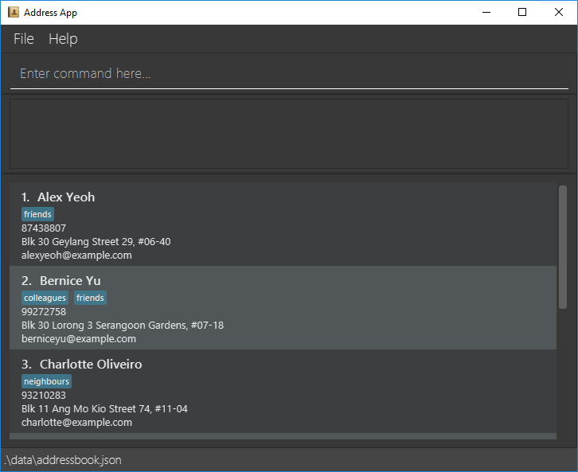

Cap 5.0 Buddy helps NUS SoC students to keep track of their module details efficiently. It helps them centralize key module details and follows their study progress through a Command Line Interface (CLI) that allows efficient management of module details.

1. [Quick Start](#quick-start)
2. [Features](#features)
   1. [Adding a module](#adding-a-new-module-add-module)
   2. [Viewing a module](#viewing-a-module-view)
   3. [Adding a zoom link to a module](#adding-a-zoom-link-to-a-module-add-zoom)
   4. [Deleting a module](#deleting-a-module-delete)
   5. [Editing a module](#editing-a-module--edit-zoom)
   6. [Adding an assignment to a module](#adding-assignment-to-a-module-addassignment)
3. [FAQ](#faq)
4. [Command Summary](#command-summary)

--------------------------------------------------------------------------------------------------------------------

## Quick start

1. Ensure you have Java `11` or above installed in your Computer.

1. Download the latest `cap5buddy.jar` from [here](https://github.com/AY2021S1-CS2103T-F12-3/tp/releases).

1. Copy the file to the folder you want to use as the _home folder_ Cap 5 Buddy application.

1. Double-click the file to start the app. The GUI similar to the below should appear in a few seconds. Note how the app contains some sample data. 
   

--------------------------------------------------------------------------------------------------------------------

## Features

**:information_source: Notes about the command format:** 

* Words in `UPPER_CASE` are the parameters to be supplied by the user. 
  e.g. in `add n/NAME`, `NAME` is a parameter which can be used as `add n/John Doe`.

### Adding a new module: `add module`

Creates and add a new module to be stored in the system.

  Format: `add module` **_`[MODULE_NAME]`_** **_`[ZOOM_LINK]`_**

   * Leaving the **_ZOOM_LINK_** part empty will create a empty module.

   Examples:
   * `add module CS2103T https:\\link` creates and add the module called CS2103T
   with the specified link into the system.
   * `add module CS2103T` creates and add the module CS2103T with no zoom link.

### Viewing a module: `viewmodule`

Views a specific module stored in the system

 Format: `viewmodule` **_`n/[MODULE_NAME]`_**

  Examples:
  * `viewmodule n/cs2103t` views the specified module

### Adding a zoom link to a module: `add zoom`

  Adds a zoom link to an existing module.

  Format: `add zoom` **_`[MODULE_NAME]`_** **_`[ZOOM_LINK]`_**

  * Adds a zoom link [ZOOM_LINK] to a module named **_`[MODULE_NAME]`_**

  Example of usage:
  `add zoom cs2103T https://sample.zoom.us` adds a zoom link `https://sample.zoom.us` to the module named `cs2103T`

### Deleting a module: `deletemodule`

Deletes the module at the specified position in the module list.

 Format: `delete` **_`[MODULE_POSITION]`_**

  Examples:
  * `deletemodule 1` deletes the module at position `1`

### Editing a module : `edit zoom`

* Edits an existing module in the module list.

Format: `edit zoom` **_`[MODULE_NAME]`_** **_`[ZOOM_LINK]`_**

* Edits the zoom link of a module named **_`[MODULE_NAME]`_** to **_`[ZOOM_LINK]`_**

Examples:
* `edit zoom CS2030 https://sample.zoom.us` edits the zoom link for a module named `CS2030`
  to `https://sample.zoom.us`
  
### Adding assignment to a module: `addassignment`

  Adds an assignment that takes up a percentage of the grade and has a result from 0.00 to 1.00 to an existing module.

  Format: `addassignment` **_`n/[MODULE_NAME]`_** **_`a/[ASSIGNMENT_NAME]`_** 
  **_`%/[ASSIGNMENT_PERCENTAGE]`_** **_`r/[ASSIGNMENT_RESULT]`_**

  * Adds an assignment **_`[ASSIGNMENT_NAME]`_** that takes up **_`[ASSIGNMENT_PERCENTAGE]`_**
  of the grade with a result of **_`[ASSIGMENT_RESULT]`_** to a module named **_`[MODULE_NAME]`_**

  Example of usage:
  `addassignment n/CS2100 a/Quiz 1 %/5 r/0.80` adds an assignment called `Quiz 1` that takes up `5`% of the 
  grade with a result of `0.80` to the module named `CS2100`

### Calculating Cumulative Average Point(CAP): `calculatecap`

Calculates the user's CAP based on completed modules

 Format: `calculatecap`

  Examples:
  * `calculatecap` calculate the user's cap
  
### Undo previous user command: `undo`

Undoes the previous user command

 Format: `undo`

  Examples:
  * `undo` 
  
### Undo previous user command: `redo`

Redoes the previously undone user command

 Format: `redo`

  Examples:
  * `redo`   
--------------------------------------------------------------------------------------------------------------------

## FAQ

**Q**: How do you add a module into the program? 
**A**: Run the program and wait for the terminal to start up. Next, type in : “add module [CS2103T]” to add a module called CS2103T.

**Q**: How do you view the zoom links of a particular module? 
**A**: When the program has started running, enter the following in the terminal : “view [CS2103T]” to view the zoom link for the module called CS2103T.

--------------------------------------------------------------------------------------------------------------------

## Command summary

Action | Format, Examples
--------|------------------
**Add** | `add module KEYWORD`  e.g. `add module CS2103T [link]`, `add module CS2103T`
**View** | `view KEYWORD `  e.g. `view cs2101` , `view all`
**Delete** | `delete KEYWORD `  e.g. `delete 3`
**Edit** | `edit zoom MODULE_NAME ZOOM_LINK`  e.g. `edit zoom CS2103T https://sample.zoom.us`
**Add Zoom** | `add zoom MODULE_NAME ZOOM_LINK`   e.g. `add zoom cs2103T https://sample.zoom.us`
**Calculate CAP** | `calculatecap`   e.g. `calculatecap`
**Undo** | `undo`   e.g. `undo`
**Redo** | `redo`   e.g. `redo`