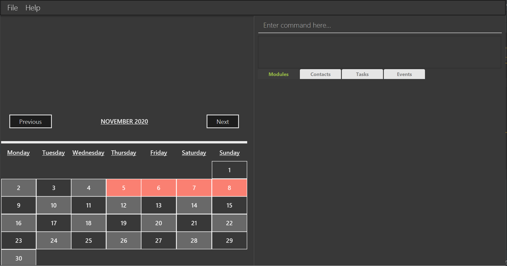

## Project: Cap 5.0 Buddy

## Overview

Cap 5 Buddy is a desktop module tracker application used to centralise key module details. The user interacts with it using a CLI, and it has a GUI created with JavaFX. It is written in Java, and has about 20 kLoC.

Figure 1. UI of Cap 5 Buddy.

## Summary of Contributions

Given below are my contributions to the project.

* **Code contributed**: [RepoSense link](https://nus-cs2103-ay2021s1.github.io/tp-dashboard/#breakdown=true&search=jonasngs)

* **Major enhancement:** Implement feature to find items using multiple search parameters

  * What it does: This feature allows the user to efficiently search for the desired contact, task or event using multiple search parameter. This ensures that module related
                  information and details can be retrieved easily whenever needed.
  
  * Justification: Finding the necessary module related information is crucial for users given that users may require the specific information 
                   at any given moment. Additionally, as users might store large numbers of different contacts, tasks and events in their application,
                   there is a need to provide a feature that allows users to conduct more accurate and refined searches. Finding items
                   using a single parameter, similar to the `FindCommand` feature provided by `Addressbook-level3` which searches for contacts based on a single name parameter,
                   may yield many search results. This can hinder user experience as users might have to scan through the search results again. As such,
                   implementing a feature which allows users to find items using more than one search parameter can narrow down the search results, increasing
                   the probability of users being able to retrieve their intended search result.
  
  * Highlights: This enhancement affects existing commands and commands to be added in future. It required an in-depth analysis of design alternatives. The implementation too was challenging as it required changes to existing commands.
  
  * Relevant Pull requests: 

* **Project management**:
  * Set up the GitHub team repo and organization
  * Managed releases `v1.2`, `v1.3` (2 releases) on GitHub
  * Managed milestones `V1.1`, `V1.3`. Closed the milestone when all issues have been completed before the stipulated deadline.

* **Enhancements to existing features**:
  * Updated the GUI color scheme (Pull requests [\#33](), [\#34]())
  * Wrote additional tests for existing features to increase coverage from 88% to 92% (Pull requests [\#36](), [\#38]())

* **Documentation**:
  * User Guide:
    * Added documentation for the Contact list management features 
    * Did cosmetic tweaks to existing documentation of features `clear`, `exit`: [\#74]()
    
  * Developer Guide:
    * Added implementation details of the `delete` feature.

* **Community**:
  * PRs reviewed (with non-trivial review comments): [\#12](), [\#32](), [\#19](), [\#42]()
  * Contributed to forum discussions (examples: [1](), [2](), [3](), [4]())
  * Reported bugs and suggestions for other teams in the class (examples: [1](), [2](), [3]())
  * Some parts of the history feature I added was adopted by several other class mates ([1](), [2]())

* **Tools**:

